## 大模型的结构
### 预处理
#### tokenization
- token：文本的基本单位（经过分词处理后的）
- 分词粒度：字符划分（无意义，序列长），词缀划分，单词划分（无法处理没讲过的word，相似的word之间构建不出来关系，中文难以划分） 
##### subword次元划分
频率高的word有自己的token，频率低的word会被划分为subword。
具体步骤为：首先按照subword进行划分，之后将出现频率最高的一对词元进行合并，比如“sub”和“word”这一对，用“subword”代替这两个。这样的话词表大小加一。重复这一过程直到满足要求。

##### 建立索引字典
将文本中的词元转换为索引
> 需要在其中加入一些特殊的字符，比如开始结束等。

##### embedding
将离散的token转换为连续的向量。最简单的方法是one-hot，但是不能表示token之间的相似度，并且维度太高，过于稀疏。
更高效的方式是word2vec：
1. CBOW：连续词袋模型，用周围的词预测中间的词
2. 跳元模型：用中间的词预测周围的词
word2vec的优点是可以表示词之间的关系。

transformer中的embedding与word2vec比较类似，直接对token乘以一个embedding的矩阵，在训练的过程中学习embedding矩阵的参数。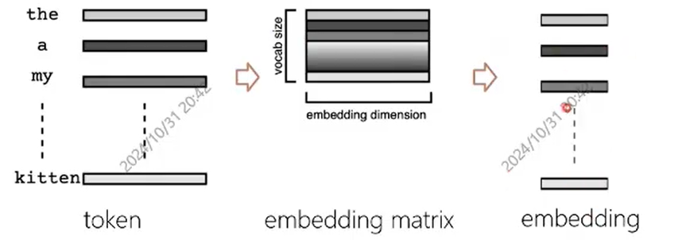

#### 位置编码
作用是表示序列中的位置信息：相同的词在句子中的不同位置表达的含义可能不同。通过这种方式将信息补充给transformer。

**三角函数表示位置编码**：
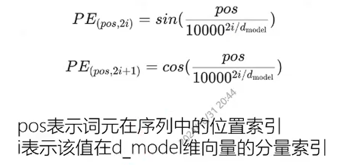
每个词元是一个dmodel维度的向量，i代表当前计算的是哪个维度。之所以是 2i 和 2i+1（偶数和奇数）分开计算，是因为每个 i 值会产生一对正弦和余弦分量，共同构成位置编码向量的两个维度。这样，一个 $d_{model}$维的位置编码向量将由 $d_{model}/2$ 对正弦和余弦值构成。
计算出这个位置编码后直接加到embedding上。

> 使用三角函数编码的原因：
> 1. 表示绝对位置信息。首先通过不同频率的波长表示不同的位置编码。i越大，频率越大，周期越小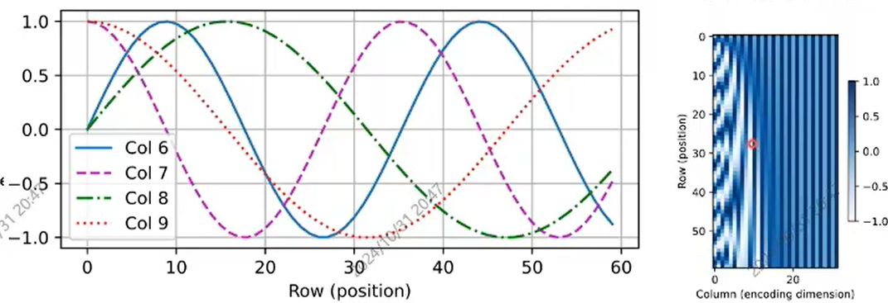
> 2. 表示相对信息
> 对于$PE(POS+k,i)-PE(POS,i)只与k有关，与POS无关$

#### rope 旋转位置编码
普通的位置编码是直接在向量上加上对应的位置，但是rope是将位置编码的向量与原来的向量进行旋转变换。这样可以在不增加参数的情况下，扩展位置编码的长度。
首先将query和key的表示旋转到相对位置的表示，之后对他们查询相似度。
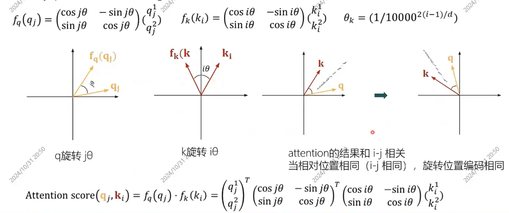它将词语的每个向量（也就是 token embedding）视为一组二维平面上的向量对。对于每个位置 m，RoPE 会给它一个特定的旋转角度 $θ_m$，然后将这个角度应用到词语向量的每一对分量上。这种编码可以捕捉相对的位置信息。

### 模型结构
#### seq2seq
详细参考深度学习那篇
#### 注意力机制
同样参考上一篇对应部分的内容。
q代表query，k代表key，v代表value。我们假设想要用q查询想要的v，那么由于v比较大，直接用q在所有v中匹配比较耗时，所以先将q与所有v的标签k匹配，找到对应的v之后，在和v中的内容配对。下面是实际的计算过程。
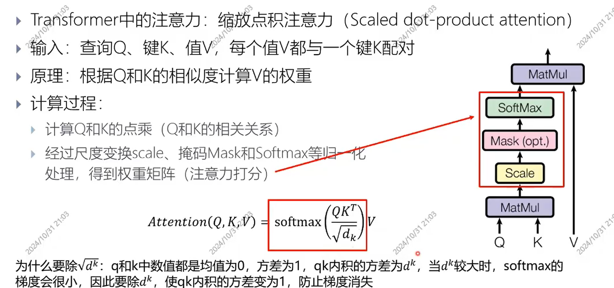

#### 自注意力机制
Q K V都是来自同一组输入，即都是通过一个***I***与三个不同的权重矩阵相乘计算而得。可以捕捉到输入内部的相关关系。
计算过程：
    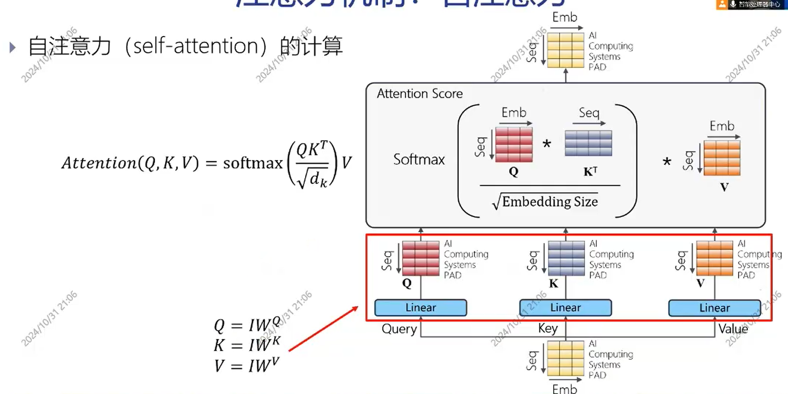
#### 多头注意力机制
QKV通过乘以不同的liner层，再经过同样步骤的计算，最后得到多个头的结果加起来。
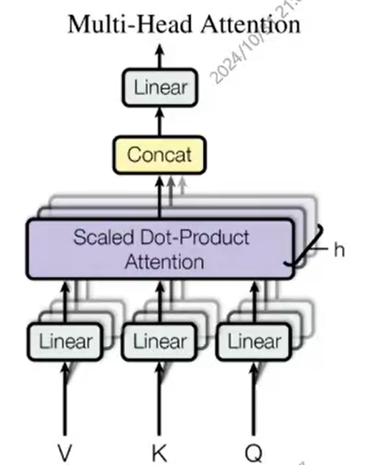
可以类比为卷积的多个通道。

#### transformer的推理
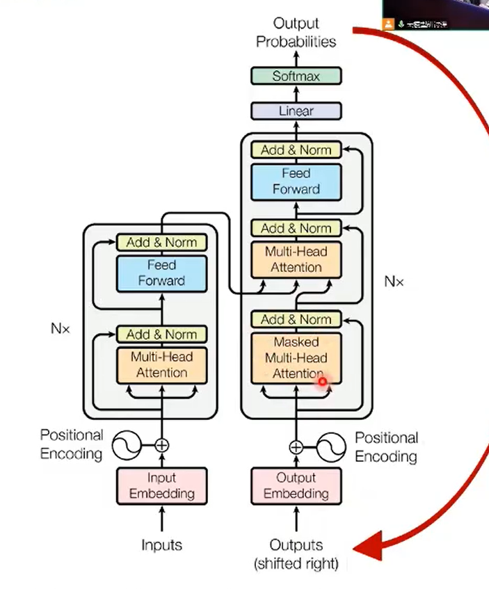
自回归：与训练不同，解码器的输入必须是上一轮推理的输出。

### 三种流派
- encoder-only
- encoder-decoder
- decoder-only

#### encoder-only （bert）
优点：由于采用的是双向encoder，可以理解上下文的信息。擅长做自然语言理解的任务，比如分类
缺点：不擅长自然语言生成的任务。只适合处理句子级别的任务，不适合文档级别的任务。

####  encoder-decoder （T5）
优点：适合做需要理解后生成的任务。如机器翻译，问答
缺点：训练的时候由于需要做交叉注意力层，所以训练效率比较低，模型复杂度高。
    并且双向attention容易退化为低秩矩阵，同等参数量下的泛化能力并没有比decoder-only更好

#### decoder-only (GPT)
由于没有编码器，所以解码器中的交叉注意力层也被取消了。
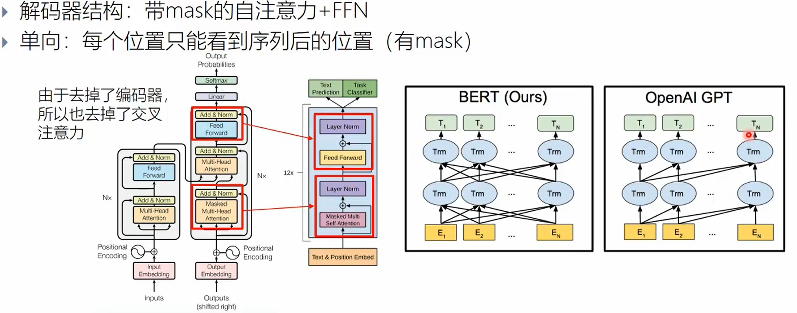

##### 预训练
自回归，给定前N-1词，预测第N个词。
##### 微调
使用下游任务的数据集与标签。对新添加的层从头训练，对其他参数微调。
目标函数：预训练与微调的目标函数的加权求和。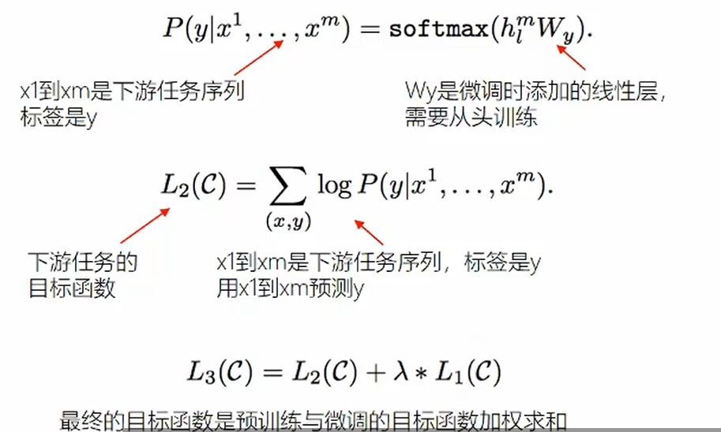
针对4种下游任务，针对输入做转换，添加特殊词元。针对结构做微调，如添加线性层等。

#### GPT-2
优点：无需微调，在预训练阶段建模多种下游任务，实现通用的NLP模型。
结构调整：归一化层（BN）提前
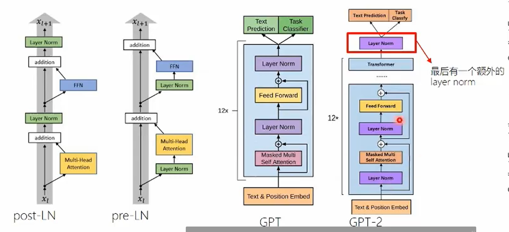
规模：更大的参数量，更大的数据

#### GPT-3
沿用了2代结构，使用更大的规模
使用sparse attention减少计算量。因为attention是一种类似于全连接的结构，那么在参数量很大的情况下，训练成本会迅速上升。
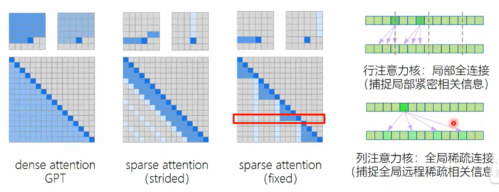

## 大模型的训练
### 训练流程
- 预训练：完成基本的补全任务，具备一定的泛化能力
- 后训练：规范输出格式，符合人类喜好，对齐
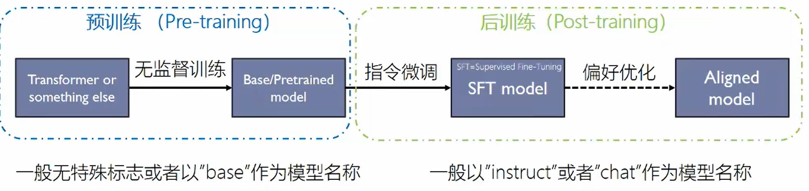

这三个模型的区别：base model无法回答问题，只能补全。sft model可以给出回答，偏好优化完的model，判断是否是危险问题，并且回答的更好。

### 预训练
无监督训练：给出前一个，预测后一个token。
1. 各个训练集的比例比较重要
2. 继续预训练：常用与领域适配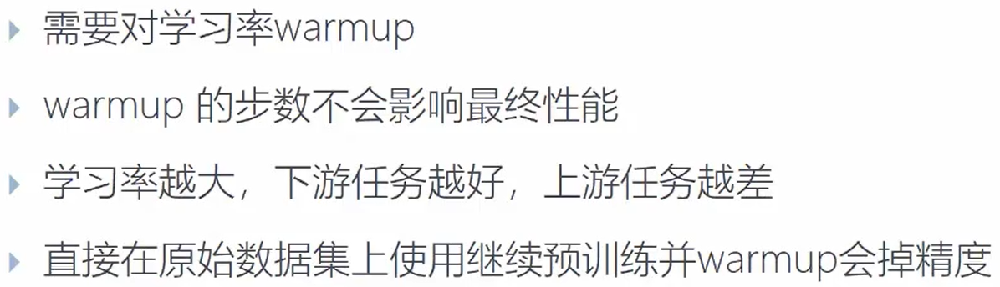
#### 测试集
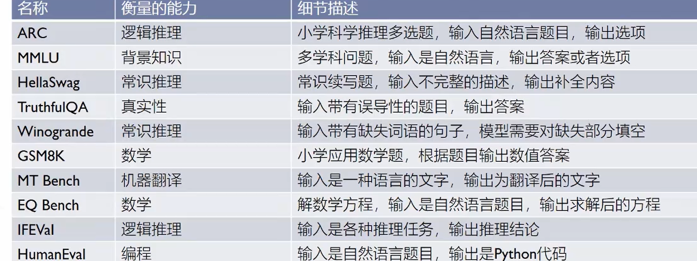

#### 尺度定律
尺度定律的核心思想是：模型的性能与模型的参数量、训练数据量成正比。也就是说，随着模型参数量和训练数据量的增加，模型的性能会逐渐提升。
他的作用是可以为我们预测在不同规模的模型和数据下，模型的性能表现，从而指导我们在实际应用中选择合适的模型规模和训练数据量。比如有一张一个月的A100，应该选多大的模型，或者想训练一个模型，应该组多少GPU等等。

#### 涌现
随着模型训练规模的增加，模型性能从随机水平出现突变，行为无法预测。
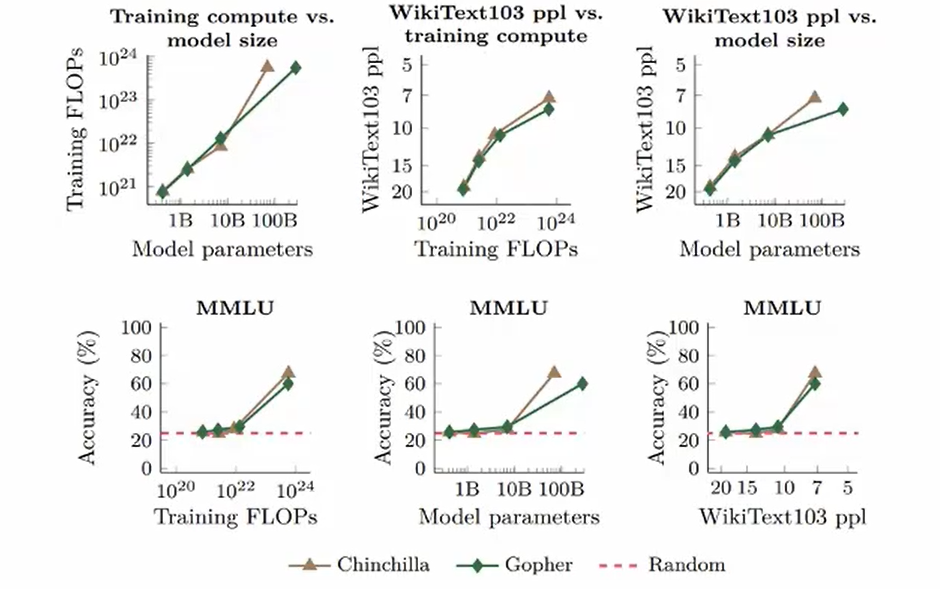
涌现的原因在于，准确率的指标非线性。实际上，根据尺度定律loss是线性拟合的，但是准确率却不是。将准确率换为编辑距离，即模型答案与准确答案之间需要修改几个字符，就发现这个指标不存在涌现现象了。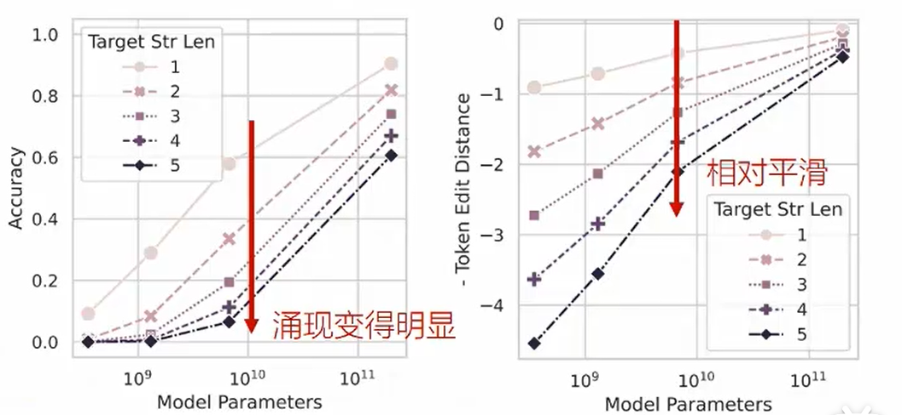

### 后训练
#### 指令微调(对齐)
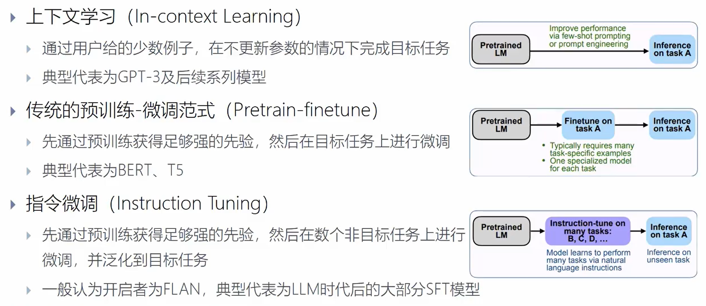
1. 收集数据
2. 监督微调：需要成对（标注）的数据，从答案开始输出并计算损失函数。
3. 数据集的构建：
    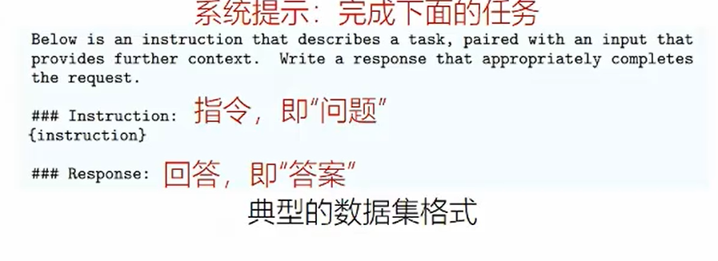
    构建方式：人工构建，开源数据集，数据合成。
4. 数据合成：
   1. 基于强模型的数据生成：使用强模型根据种子任务生成指令或人工指令，获得指令的回答。得到<指令，回答>对。问题是，可能这样训练出来的永远无法超过这个模型。  
   2. 基于大模型自身的数据合成：
#### RL 强化学习
为什么后训练需要RL？
> 指令微调的目标是最大化标注回复的生成概率，而对齐的目的是生成的回复符合人类偏好，因此需要RL进一步对齐。

PPO算法是最常用的强化学习算法之一

#### 参数微调
略

## 大模型的推理
### 解码
自回归语言生成模型：模型生成的token只依赖前面生成的内容。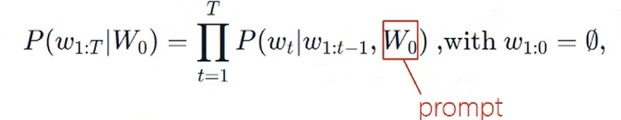
解码就是如何从概率P中选择下一个token

#### 贪心搜索
每一步都选择概率最高的token输出
不足：容易重复文本，且忽略全局最优

#### 束搜索
保留概率最高的几个句子
不足：倾向于生成短的句子，因为每次的概率小于1.句子越长概率越小。

#### 惩罚约束
针对上面的不足，对重复惩罚：
将与上文组成n-grams的生成候选词的概率置0.比如上面有北京，后面生成'北'之后，将‘京’的概率置0或概率降低.
长度惩罚：
将概率除以其长度的指数幂

#### 采样
还有个问题，人类语言并不一定满足最大概率。因此需要引入随机性，根据概率输出token。
不足：会产生乱码。
解决办法：
1. 降低采用低概率token的概率，做一个softmax。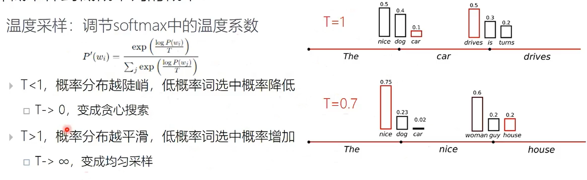
2. TOP-K采样：从最高的k个答案中重新归一化采样。
3. TOP-P采样：从前几个概率加和大于P的几个答案采样。

#### 对比解码
利用小模型提高解码质量。大模型与小模型的区别在于，大模型输出正确token的概率更高。因此对比大小模型的输出，找到概率提高的token，就知道哪个可能是正确答案。

不足：计算成本高，需要合适的小模型

### 解码加速
LLM通常是基于下一个token实现的，这种串行特性导致解码速度慢。IO是他的运行瓶颈，解码延迟主要来自于LLM权重从显存搬运到计算单元的过程。

#### 并行解码
一次解码多个token，使用非自回归的方式。
增加两个解码头，同时预测后面多个token，之后针对输出结果，使用原来的LLM并行验证。之后只接受正确的部分
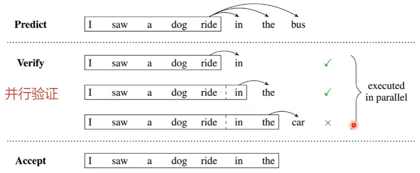
进一步优化：在验证错误的时候继续预测
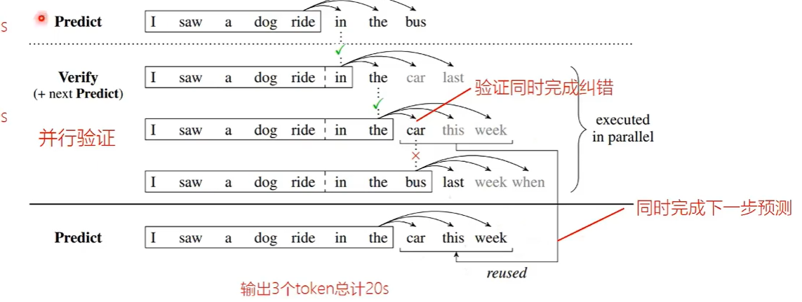

#### 投机解码
1. 大模型解码慢，小模型解码快
2. 有的词预测困难，有的简单
因此使用小模型预测简单的，大模型预测难的。
具体做法：
用小模型连续输出，用大模型并行验证。
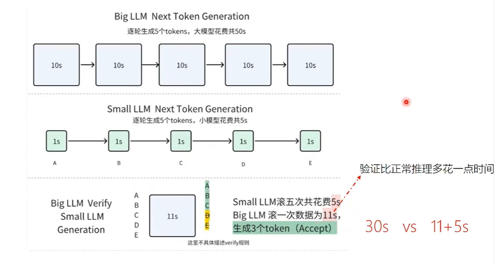
加速比：每轮生成的token越多，花费时间越短，加速比越大。
#### 总结
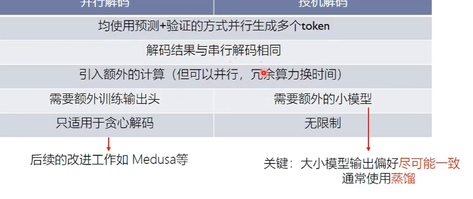

### 提示词
可以指示大模型需要做什么任务，比如翻译等等。意思相近的prompt可能会导致不同的性能，与训练的时候的prompt越相近，效果越好。

#### 提示工程
设计和优化提示词来提升llm在复杂任务上的能力
1. 明确任务目标
2. 提供角色背景
3. 格式清晰 任务： 段落： 要求： 这样分开来写
4. 提供少量示例
5. 万能咒语：深呼吸，如果回答错了会有100个老奶奶嗝屁。。。
6. PUA大模型

### 上下文学习
无需训练，通过使用任务描述加示例的prompt，llm可以理解新任务。
- zero-shot: 将任务描述为一个prompt给大模型
- few-shot:将几个任务示例交给大模型

#### 上下文学习偏差
- 多数标签偏差：llm会倾向于prompt中频率高的答案
- 近因偏差：倾向于prompt中后出现的答案
- 常见词偏差：倾向输出训练数据集中频率高的

#### 校准偏差
1. 估计偏差：用一个空的实例做测试，看输出结果的概率分布。正常来说应该各50%，实际上会有所偏差。
2. 校准：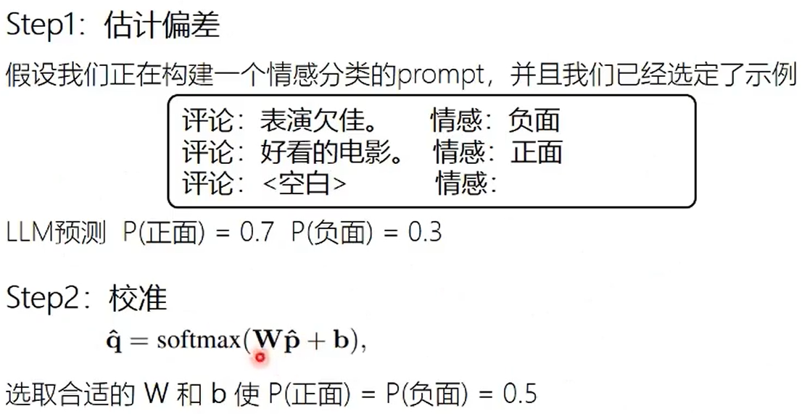

#### 标签的影响
实验发现，即使使用随机的标签，实验结果也只有微小的下降。但是仍然显著好于没有标签。

#### 示例的影响
少量的示例即可显著增加性能。

### 思维连 COT
在遇到复杂问题时，如果直接输出，往往无法得到好的结果。在中间加上一步思考的过程可以显著提升正确率。
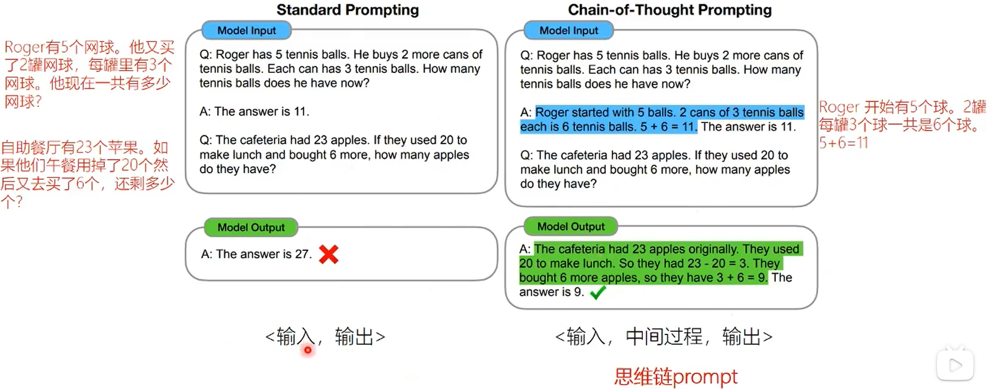

怎么使用COT呢，只需要加上一个 let's think step by step的prompt，大模型就会自己生成推理的过程。

#### 改进
- self-consistency
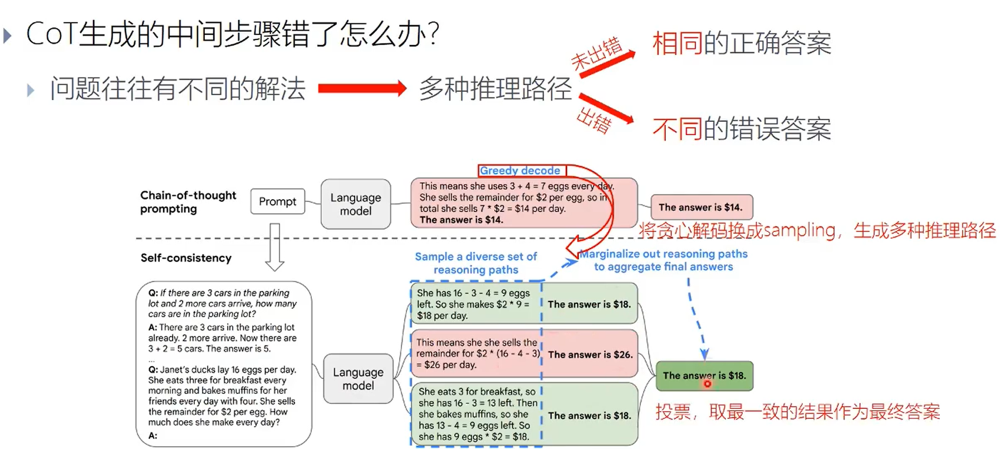
- tree of thought 将链式推理改为树形推理

### 检索生成增强 RAG
目的：大模型都是用过期的知识训练的，但是知识每天都在更新。这一方法可以让大模型搜索外部知识。
方法：将搜索到的信息当做prompt放到提示词中

### 长上下文推理
上下文推理的长度可以衡量大模型的能力，在许多的任务需求都需要长上下文，比如问文章摘要，多轮问答，语言翻译，对话ai等等。

#### 长上下文推理测试
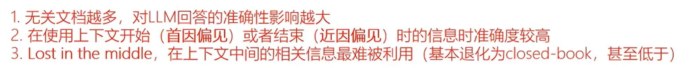

#### 怎么提升上下文推理能力
1. 位置编码：通过绝对、相对位置编码将位置信息编码添加到上下文表示。

2. 位置外推: 在推理的时候处理比训练长度更长的序列
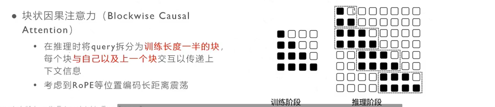
3. 位置内插：在推理时在序列中插入或整合新的信息，以扩展上下文长度
比如训练的时候上下文长度是512，推理的时候想要处理1024的上下文，那么在实际推理的时候，将偏移乘以0.5，这样就实现了在512的范围内进行推理了。
4. 提示压缩：通过缩短原始prompt的长度并保留重要信息的方式来扩展上下文。（memgpt）

### llm智能体

### llm系统软件
#### 存储分析
模型参数量的分布
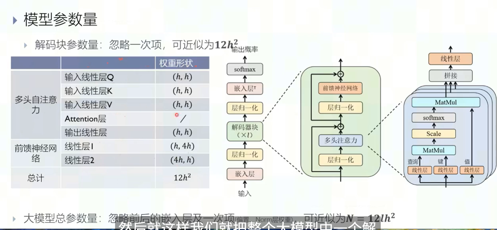

训练过程中的存储占用
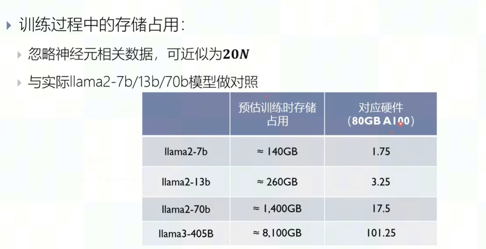

#### 计算分析
计算量：一次运算需要的浮点运算次数（FLOPS）
访存量：一次运算需要的访存次数（BYTE）
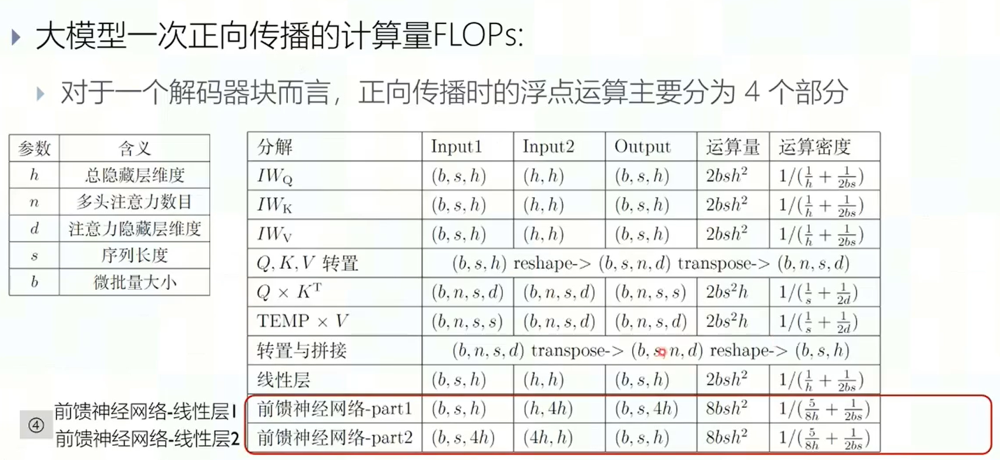
将这些都加起来得到结果，大模型一次正向传播消耗$l*(24bsh^2+4bs^2h)$
反向传播一般是正向消耗的2倍。那么一次训练消耗的计算量就是上式的三倍。
我们对其中的变量进行重组，得到大模型最终训练消耗的计算量为6ND，其中N为参数量，D是大模型总token数目。    

#### 时间分析
在实际计算的时候，会有重计算的影响，因此总计算量估计为8ND。因此可以用这个来预估训练时间。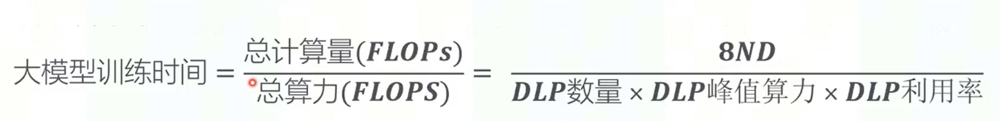

### 分布式计算
#### 存储优化
1. 数据并行：解决单节点算力不足的问题，每个设备共享完整的模型副本
2. 张量并行：单个算子过大，需要进行并行。分为按行切分与按列切分
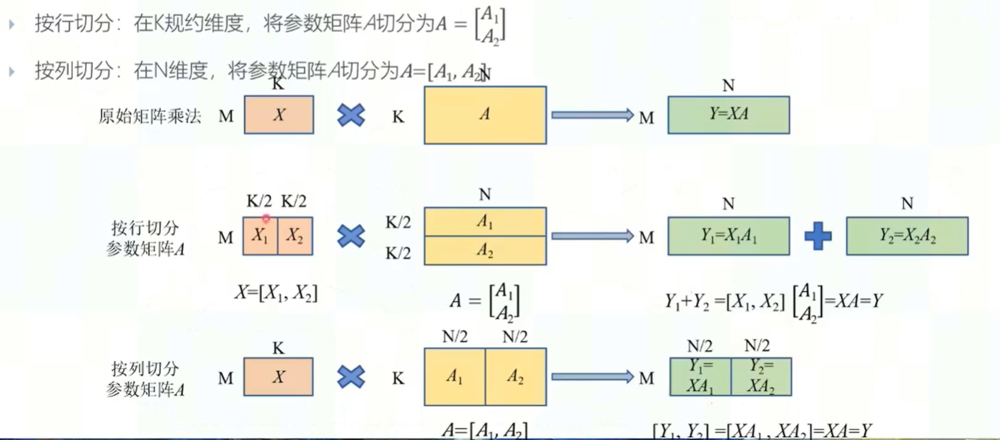
3. 流水线并行：单个算子参数量较小，但总参数量超过设备的存储容量，就需要在算子间切分。实际执行的时候，由设备一执行算子一，设备二执行算子二。但是这样会带来一个空泡的问题，即设备一在执行的时候，设备二在空等。因此引入流水线技术。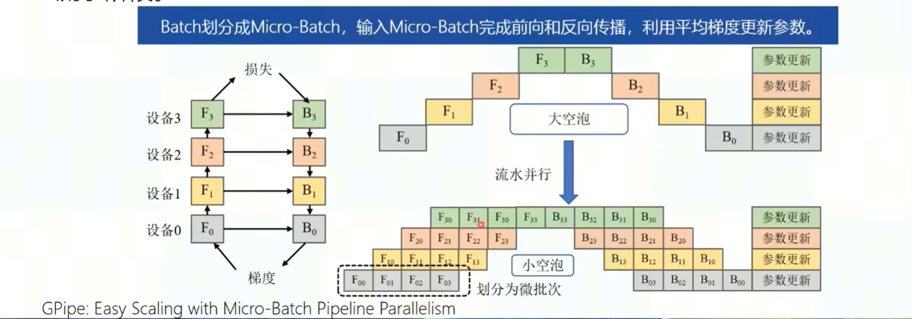
4. 序列并行：解决大模型长上下文的问题，attention层的计算复杂度为$O(s^2)$，为一个瓶颈。
   1. ringattention：每个节点保存一部分QKV，通过环形通讯在节点间传递KV数据，每次接受数据后就计算这一部分内容。
   2. deepspeed Ulysee：对序列维度s的激活值进行拆分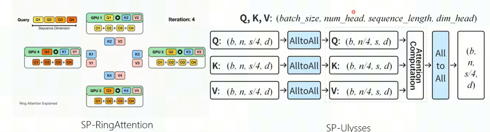
5. 总结
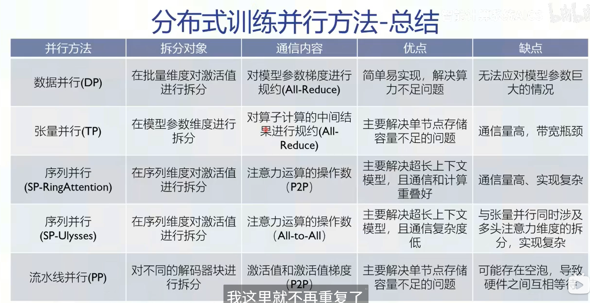

#### 计算效率优化
##### 混合精度训练
除了FP16 32之外，各类智能硬件还设计了专用的数据类型
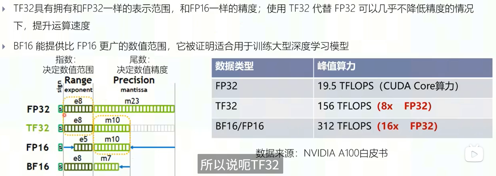
