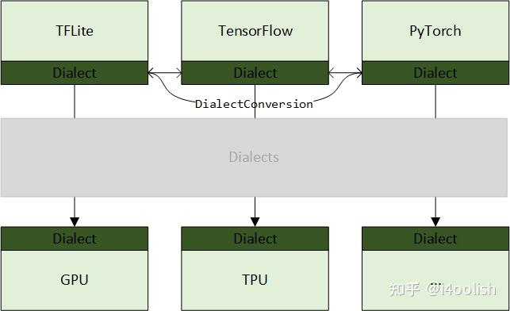
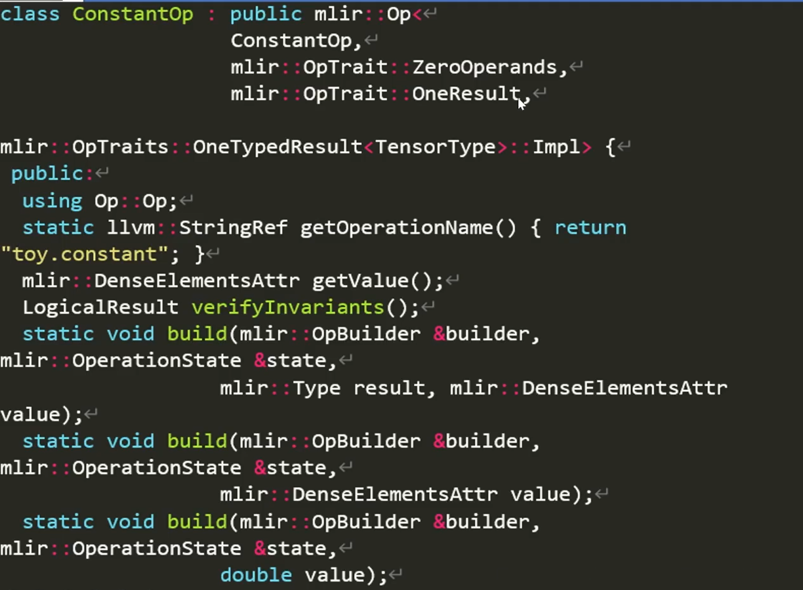
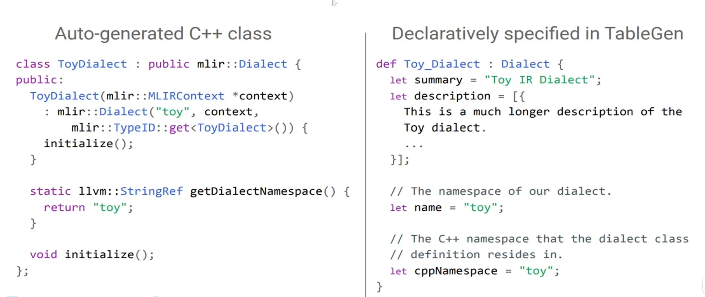
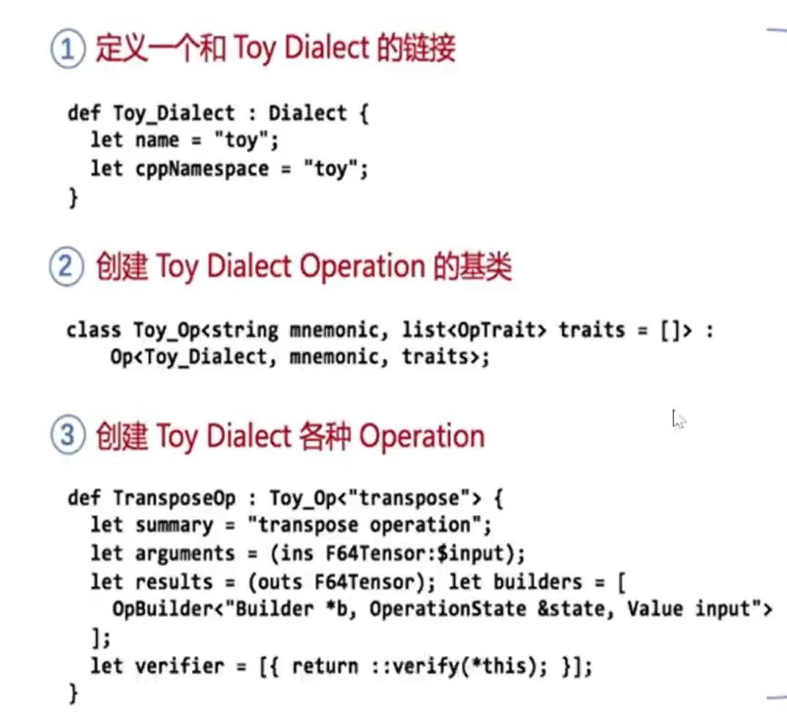
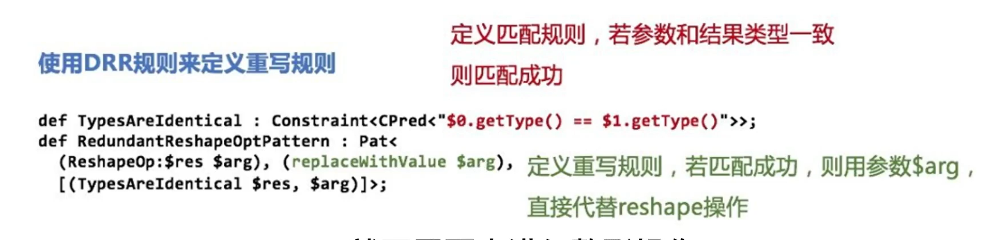
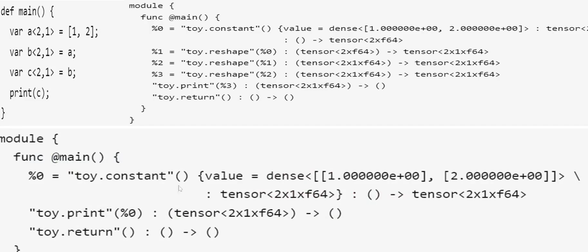
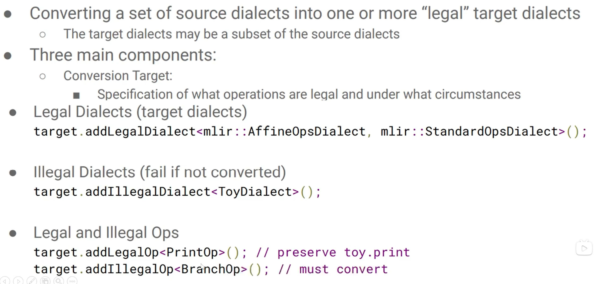
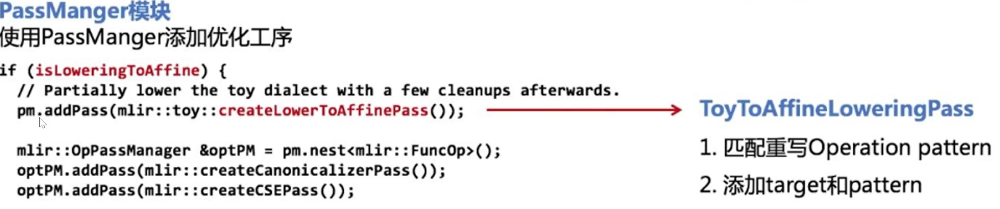
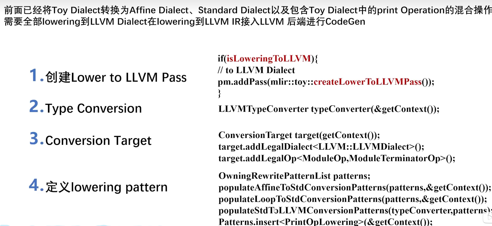
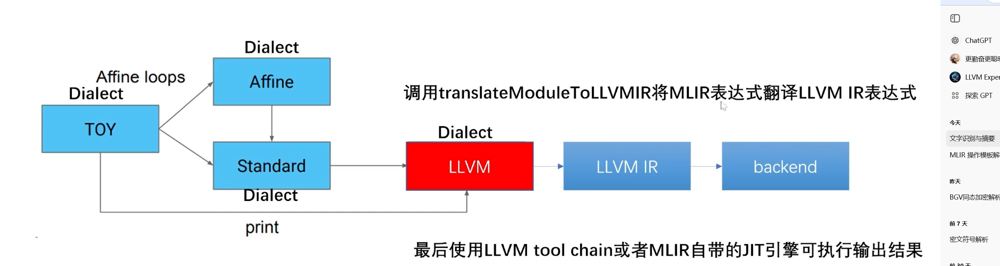

### mlir的作用
MLIR出现的核心背景即：提供一套中间模块（即IR，后面不再拿IR来描述，以模块来描述更容易理解），这个中间模块有两个作用：1. 对接不同的软件框架；2. 对接软件框架和硬件芯片。


## MLIR语法结构
#### 操作定义
在td文件中，操作（operations）是通过定义操作类来描述的。每个操作类包含操作的名称、输入和输出类型、属性以及操作的行为等信息。例如，下面是一个简单的操作定义示例：
```tablegen
def MyAddOp : Op<"mydialect.add", [NoSideEffect]> {
  let summary = "Adds two numbers";
  let description = [{
    This operation takes two input numbers and produces their sum.
  }];
    let arguments = (ins
        AnyType:$lhs,
        AnyType:$rhs
    );
    let results = (outs
        AnyType:$result
    );
}
```
### OP结构
MLIR 的一个 Operation 里可以包含下面的一些东西：

- Operand：这个 Op 接受的操作数
- Result：这个 Op 生成的新 Value
- Attribute：可以理解为编译器常量
- Region：这个 Op 内部的 Region
其中Value 必然包含 Type，Type 也可以作为 Attribute 附加在 Operation 上。
### 基本块结构
首先他没有phi函数，而是通过基本块参数来实现。
比如一个基本块参数来自两个前驱，那么它的前驱在跳转他的时候会讲这个参数包含在跳转里。

    module {
    func.func @foo(%a: i32, %b: i32, %c: i32) -> i32 {
        %cmp = arith.cmpi "sge", %a, %b : i32
        cf.cond_br %cmp, ^add(%a: i32), ^add(%b: i32)
    ^add(%1: i32):
        %ret = llvm.add %1, %c : i32
        cf.br ^ret
    ^ret:
        func.return %ret : i32
    }
    }

比如这里的add跳转就是，将参数%a直接填在后面
对于

    %0:4 = "dialect.op1"() {"attribute name" = 42 : i32} : () -> (i1, i16, i32, i64)
=左边的%0为"dialect.op1"的结果值标识符，:4表示有4个，分别是%0#0, %0#1, %0#2 和 %0#3。()表示输入为空，{"attribute name" = 42 : i32}表示存在一个属性，名字是"attribute name"，值为i32类型的42,attribute可以理解为编译器常量，有的时候我们要塞一些信息补充下这个Operation，其是个键值对，甚至有些op的必要信息本质也是Attr，比如函数的sym_name(函数名)、function_type(参数类型)。:后描述的就是类型的描述了，从空输入到产生一个i1, i16, i32和i64类型的输出，分别对应%0#0，%0#1, %0#2 和 %0#3。

### 类型转换
所有的OP都是一个operation指针，参数传入的时候通过dyn_cast进行转换。两个operation*相等，指的是它们指向同一个 Operation 实例，而不是这个 Operation 的 operand,result,attr 相等。

**Hashing**：在不修改 IR 的情况下，每个 Operation 有唯一地址。于是，可以直接用 Operation* 当作值建立哈系表，用来统计 IR 中数据或做分析：
```cpp
#include "llvm/ADT/DenseMap.h"
llvm::DenseMap<Operation*, size_t> numberOfReference;
```


## dialect创建
### operation 构建

继承自官方的OP类，对于几个属性，解释如下
OPTrait::Zerooperand 代表无参数输入
OPTrait::Zerooperand 代表只有一个输出结果
。。。
这样写非常复杂，所以采用下面的ODS框架加速开发

## ODS
### 生成dialect

左侧是生成的cpp代码，右边则是我们要编写的文件。
生成的dialect

### operation

会生成对应的xxx.h.inc文件，里面就是类的定义的c++代码，一般位于include文件中

## MLIR表达式变形
### drr框架
这个是用来添加自定义的优化的，通过模式匹配来寻找可以优化的地方

优化结果

## lowering过程
这个过程是生成c++代码的一个步骤，相当于从高级IR到低级IR，这里指的是低级dialect

1. namespace转换：首先添加后续的两种dialect为合法方言，再将原本的方言设置为非法方言，并对要保留的操作，和要废弃的操做也做同样的事
2. operation转换：通过模式匹配
3. type转换：。。

转换模式：
1. 部分转换，可以将上一层级的部分信息做保留到下一层级
2. 全部转换

### 部分转换
一个高抽象级别的Dialect到一个低抽象级别的Dialect过程中，可以只lowering其中一部分Operation，剩下的Operation只需要升级与其他Operation共存即可


### 完全转换




## 方言转换实战
### 项目结构
一共需要准备如下内容：
1. 已经定义好，注册好的两个方言，这一步骤不在这里说明
2. pass.td中注册pass
3. conversion文件，例如ONNXTOEARTH.cpp，当做一个pass实现并添加到mlir的优化流程中。需要依赖上述的两个文件的定义。
4. typeConverter的定义文件，需要在这里定义自己的typeConverter并添加规则，用于对两个方言之间做类型转换。

### pass注册
在conversion的文件夹中新建pass.td,在里面添加对该pass的定义，内容如下
```td
def ONNXToEarthConversion : Pass<"convert-onnx-to-earth", "::mlir::func::FuncOp"> {
  let summary = "Convert ONNX dialect to Earth dialect";
  let description = [{
    This pass converts supported ONNX ops to Earth dialect instructions.
  }];
  let constructor = "::hecate::onnx::createONNXToEarthConversionPass()";
  let dependentDialects = ["hecate::onnx::ONNXDialect", "hecate::earth::EarthDialect", "mlir::tensor::TensorDialect"];
  let options = [
  ];
}
```
之后在cmakelist中添加以下内容mlir_tablegen(Passes.h.inc -gen-pass-decls -name Conversion),运行编译命令之后，会根据td文件自动生成Passes.h.inc，一般生成在build目录下。在pass实现的地方需要包含这个文件。

执行完这一步后，当编译项目时，CMake 会自动调用` TableGen `生成` Passes.h.inc `和` Passes.cpp.inc `文件。
### conversion文件结构
首先在一个匿名的命名空间中声明所有转换范式，即被转换方言有多少要转换的op，就要有多少个转换范式，具体例子如下：
```cpp
struct ONNXAddOpLowering : public OpConversionPattern<mlir::ONNXAddOp> {
public:
  // 继承基类的构造函数
  using OpConversionPattern<mlir::ONNXAddOp>::OpConversionPattern;
  /**
   * @brief 封装创建 earth.add 操作的逻辑
   * @param loc 原始操作的位置信息，用于调试
   * @param resultType 转换后新操作应该返回的类型
   * @param lhs 转换后的左操作数
   * @param rhs 转换后的右操作数
   * @param rewriter 用于创建新指令的重写器
   * @return 创建好的 earth.AddOp
   */

  // --- 这是模式匹配和重写的核心函数 ---
  LogicalResult
  matchAndRewrite(mlir::ONNXAddOp onnxAddOp, OpAdaptor adaptor,
                  ConversionPatternRewriter &rewriter) const override {

    // 1. 获取原始操作的位置信息
    Location loc = onnxAddOp.getLoc();

    // 2. 获取已经转换好的操作数 (Operands)
    // 'adaptor'
    // 是一个非常有用的辅助对象，它包含了已经经过类型转换的输入操作数。
    // 我们不需要手动转换 onnxAddOp.getA() 和 onnxAddOp.getB()。
    Value lhs = adaptor.getA();
    Value rhs = adaptor.getB();

    // 3. 确定新操作的返回类型
    // 我们不能直接使用 onnxAddOp.getResult().getType()，因为它可能是旧的类型。
    // 必须使用 TypeConverter 来获取转换后的目标类型。
    Type resultType =
        getTypeConverter()->convertType(onnxAddOp.getResult().getType());
    if (!resultType) {
      // 如果类型转换器不知道如何转换此类型，则匹配失败
      return rewriter.notifyMatchFailure(onnxAddOp,
                                         "failed to convert result type");
    }

    // 4. 调用您定义的 `add` 函数来创建新的 earth.add 指令
    earth::AddOp earthAdd = add(loc, resultType, lhs, rhs, rewriter);

    // 5. 使用新创建的操作的结果来替换原始的 onnx.add 操作
    // rewriter.replaceOp 会将 onnxAddOp 的所有用途（uses）替换为
    // earthAdd.getResult()， 然后删除 onnxAddOp。
    rewriter.replaceOp(onnxAddOp, earthAdd.getResult());

    // 6. 返回成功
    return success();
  }
};

```

前面说过，这个转换过程是当做一个pass实现的，所以需要对pass进行定义，里面需要包含runOnOperation函数，即整个pass的执行入口。
```cpp
struct ONNXToEarthConversion
    : public hecate::impl::ONNXToEarthConversionBase<ONNXToEarthConversion> {
  using Base::Base;

  void runOnOperation() override {
    llvm::outs() << "begin to conver!"
                 << "\n";
    ConversionTarget target(getContext());

    auto func = getOperation();

    mlir::RewritePatternSet patterns(&getContext());

    // need change
    auto level_attr = func->getAttrOfType<IntegerAttr>("init_level");
    int64_t base_level = level_attr ? level_attr.getInt() : 13;

    hecate::PolyTypeConverter converter(base_level);
    target.addLegalDialect<hecate::ckks::CKKSDialect>();
    target.addLegalDialect<tensor::TensorDialect>();
    target.addDynamicallyLegalOp<func::FuncOp>([&](func::FuncOp fop) {
      return converter.isSignatureLegal(fop.getFunctionType());
    });
    target.addDynamicallyLegalOp<func::ReturnOp>([&](func::ReturnOp rop) {
      return llvm::all_of(rop.getOperands(), [&](auto &&v) {
        return converter.isLegal(v.getType());
      });
    });
    target.addIllegalDialect<hecate::earth::EarthDialect>();

    hecate::earth::populateEarthToCKKSConversionPatterns(
        &getContext(), converter, patterns, base_level);
    mlir::populateFunctionOpInterfaceTypeConversionPattern<func::FuncOp>(
        patterns, converter);

    if (failed(applyPartialConversion(getOperation(), target,
                                      std::move(patterns))))
      signalPassFailure();
  }
};
```

### typeConverter的定义文件
这个文件里对类型转换做了定义。具体添加定义的方式如下：

```cpp
PolyTypeConverter::PolyTypeConverter(int64_t base_level)
    : base_level(base_level) {
  addConversion([&](mlir::Type t) { return t; });
  addConversion([&](mlir::RankedTensorType t) { return convertTensorType(t); });

  addConversion(
      [&](hecate::earth::CipherType t) { return convertCipherType(t); });
}
```
通过addConversion的方式为类型转换添加范式。在conversion的转换pattern中，调用该TypeConverter就可以自动识别所属的类型并进行转换。其中addConversion的输入参数是被转换方言的类型，返回值是目标方言的类型。


