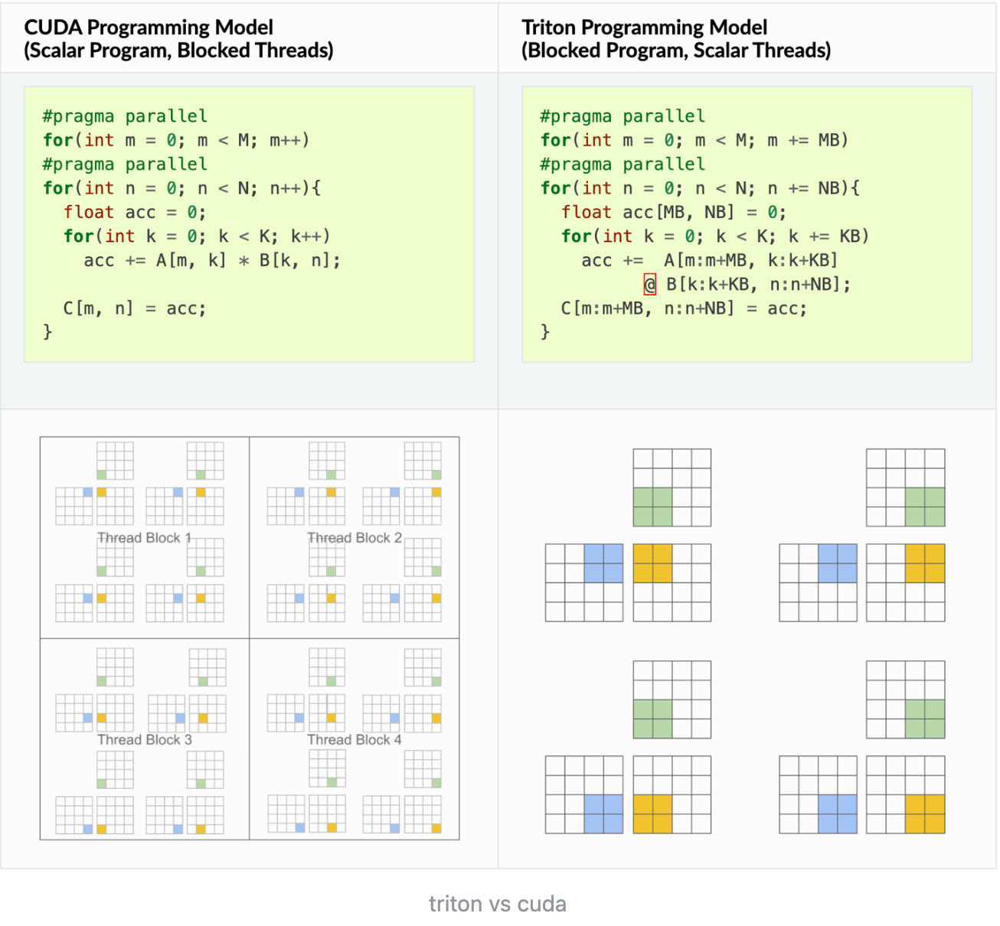

### 头文件飘红解决办法
- 命令里面 select a kit 
- cmake set(CMAKE_EXPORT_COMPILE_COMMANDS True)生成compile_commands.json
- 创建配置文件

    {
        "clangd.fallbackFlags": [
            "-I${workspaceFolder}/include"
        ],
        // "clangd.path": "the/path/to/clangd/executable/on/windows",
        "clangd.detectExtensionConflicts": true,
        "clangd.arguments": [
            // 在后台自动分析文件（基于complie_commands)
            "--background-index",
            // 标记compelie_commands.json文件的目录位置
            "--compile-commands-dir=build",
            // 同时开启的任务数量
            "-j=12",
            // 告诉clangd用那个clang进行编译，路径参考which clang++的路径
            // "--query-driver=/usr/bin/clang++",
            // clang-tidy功能
            "--clang-tidy",
            "--clang-tidy-checks=performance-*,bugprone-*",
            // 全局补全（会自动补充头文件）
            "--all-scopes-completion",
            // 更详细的补全内容
            "--completion-style=detailed",
            // 补充头文件的形式
            "--header-insertion=iwyu",
            // pch优化的位置
            "--pch-storage=disk"
        ],
        "clangd.serverCompletionRanking": true,
    }

### 参考链接

https://blog.csdn.net/weixin_45896211/article/details/135310728


### clangd.format
    "C_Cpp.clang_format_fallbackStyle": "{ PointerAlignment: Left, ColumnLimit: 100 }",
    "files.associations": {
        "__bit_reference": "cpp",
        "__hash_table": "cpp",
        "__locale": "cpp",
        "__node_handle": "cpp",
        "__split_buffer": "cpp",
        "__threading_support": "cpp",
        "__tree": "cpp",
        "__verbose_abort": "cpp",
        "array": "cpp",
        "bitset": "cpp",
        "cctype": "cpp",
        "clocale": "cpp",
        "cmath": "cpp",
        "complex": "cpp",
        "cstdarg": "cpp",
        "cstddef": "cpp",
        "cstdint": "cpp",
        "cstdio": "cpp",
        "cstdlib": "cpp",
        "cstring": "cpp",
        "ctime": "cpp",
        "cwchar": "cpp",
        "cwctype": "cpp",
        "deque": "cpp",
        "execution": "cpp",
        "memory": "cpp",
        "fstream": "cpp",
        "initializer_list": "cpp",
        "iomanip": "cpp",
        "ios": "cpp",
        "iosfwd": "cpp",
        "iostream": "cpp",
        "istream": "cpp",
        "limits": "cpp",
        "locale": "cpp",
        "mutex": "cpp",
        "new": "cpp",
        "optional": "cpp",
        "ostream": "cpp",
        "print": "cpp",
        "queue": "cpp",
        "ratio": "cpp",
        "set": "cpp",
        "sstream": "cpp",
        "stack": "cpp",
        "stdexcept": "cpp",
        "streambuf": "cpp",
        "string": "cpp",
        "string_view": "cpp",
        "tuple": "cpp",
        "typeinfo": "cpp",
        "unordered_map": "cpp",
        "unordered_set": "cpp",
        "variant": "cpp",
        "vector": "cpp",
        "algorithm": "cpp"
    }
放在setting.json

### .clangd配置
在项目根目录下创建一个名为`.clangd`的文件，内容如下：

```yaml
CompileFlags:
  CompilationDatabase: build
  Add:
    - --gcc-install-dir=/usr/lib/gcc/x86_64-linux-gnu/11
    - -I/home/songyexin/GPU-train/src
    - -x
    - cuda
    - --cuda-path=/usr/local/cuda
    - --cuda-gpu-arch=sm_52
    - --cuda-host-only
  Remove:
    - -fno-lifetime-dse
    - -forward-unknown-to-host-compiler
    - --options-file
    - CMakeFiles/cuda_train.dir/includes_CUDA.rsp
    - --generate-code=arch=compute_52,code=[compute_52,sm_52]
    - -rdc=true
    - -lineinfo
    - -x
    - cu
```