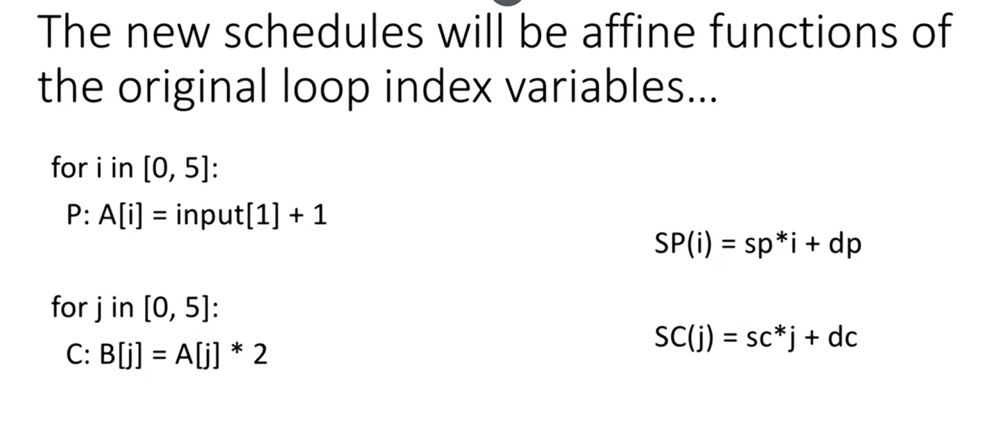
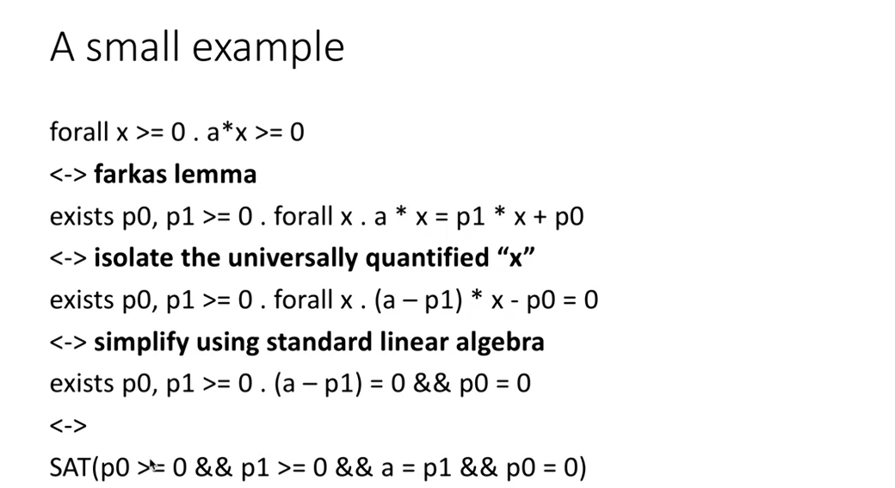

## 多面体模型
### 一个例子
```python
for i in range(1,4):
    A[i] = A[i-1]


for i in range(4,1,-1):
    A[i] = A[i-1]
```
这两组循环显然是不能转换的，多面体模型研究的就是在什么情况下是可以转换的。

#### 时间表
时间表（schedule）是多面体模型的核心概念之一。时间表定义了每个语句在执行时的时间点。通过调整时间表，可以实现循环变换、并行化等优化。在上面的例子中，我们可以为每个语句定义一个时间表：
- 语句1（`A[i] = A[i-1]`）的时间表：T1(i) = i
- 语句2（`A[i] = A[i-1]`）的时间表：T2(i) = 4 - i   
只有当第二个时间表中语句的数据依赖关系与第一个时间表中语句的数据依赖关系一致时，才能进行转换。即在0 <= i <= 3范围内，T1(i) < T1(i-1) 与 T2(i) < T2(i-1) 必须同时成立（抑或找不到一个解满足相反情况的式子）。带入到上面的时间表中，可以发现两者并不一致，因此不能进行转换。

### 形式化构建
#### ILP (整数线性规划)
像上面的例子那样，能否做转换主要取决于能否找到一个解违反数据依赖关系的时间表。线性规划问题可以解释为在一组线性不等式约束下，最大化或最小化一个线性目标函数的问题。举个例子：
```
Maximize: z = 3x + 4y
Subject to:
  2x + y ≤ 20
  4x - 5y ≥ -10
  x ≥ 0
  y ≥ 0
``` 

#### 多维下的扩展
多维下的时间表使用字典序进行比较。例如，考虑以下代码片段：
```python
for i in range(1,4):
    for j in range(1,4):
        A[i][j] = A[i-1][j+1]
```
我们可以为语句定义一个二维时间表：
- 语句（`A[i][j] = A[i-1][j+1]`）的时间表：T(i,j) = (i, j)
在这种情况下，时间表的比较将首先比较第一个维度（i），如果相等，则比较第二个维度（j）。这种多维时间表允许更复杂的循环变换和优化。

注意到这里有个分支，就是判断第一个维度或者在第一个维度相等时判断第二个维度。由于ILP不支持量词，因此需要将这种分支展开成多个ILP问题来解决。
> 如果要判断这个循环是否能够交换，只需判断在满足依赖关系 $i'=i+1, j'=j-1$ 且在合法范围内的前提下，会不会出现交换后的消费者时间 $[j', i']$ 早于生产者时间 $[j, i]$ 的情况？

使用ILP只能判断这种转换是否合法，要想找到一个转换就需要用到多面体模型。

### 调度
对于两个循环如果我们想要对其调度来增大代码的locality，我们需要找到一个时间表使得两个循环的时间表一致。此时的调度需要引入一些变量来使调度后依然有解。

注意到，这里引入了sp与dp来对原本的i做仿射变换，从而使得两个循环的时间表一致。这里的sp与dp是调度变量，通过调整它们的值，可以实现不同的调度方式。
#### 调度的ILP构建
与前面讲的类似，这里也需要构建ILP来判断调度是否合法。以上图为例，依然需要满足数据依赖：`forall 0 <= i <= 5 && 0 <= j <= 5 && i == j. SP(i) <= SC(j)`。这里加上`i=j`是因为只有在这个条件下（都访问A的同一地址）才存在数据依赖关系。带入上图的等式可以得到`forall 0 <= i <= 5 && 0 <= j <= 5 && i == j. (sp * i + dp) <= (sc * j + dc)`。
这个等式显然无法用线性规划求解，因此我们引入了Farkas引理，将其转换为线性不等式组来求解。调度问题可以抽象为下面的式子，左边是约束条件，右边是依赖关系。
$$\forall x \in \{ x \mid Ax + b \ge 0 \} \space .\space s^T x + d \ge 0$$
根据Farkas引理，上面的式子等价于下面的式子。
$$\exists p_0, p \ge 0, \forall x \space .\space  s^T x + d = p^T (Ax + b) + p_0$$
解释：仿射函数式非负的当且仅当它可以写成一个组成多面体的约束的非负组合。
一个例子：


### 应用Farkas到具体优化上
还是上面的例子，我们可以将`forall 0 <= i <= 5 && 0 <= j <= 5 && i == j. (sp * i + dp) <= (sc * j + dc)`转换为`forall 0 <= i <= 5 && 0 <= j <= 5 && i == j. -sp * i + sc * j + (dp - dc) >= 0`。根据Farkas引理，我们可以将这个式子转换为ILP问题。
> 注意到式子的前半部分的约束构成了一个多面体，这也是多面体模型名称的由来。

#### 引入变量进行通用表示
通过引入新变量$w$来将上式转换为$-sp * i + sc * j + (dp - dc) <= w$，w越小代表调度后的时间差越小，即locality越好。我们可以将w作为目标函数进行优化，从而找到最优的调度方式。