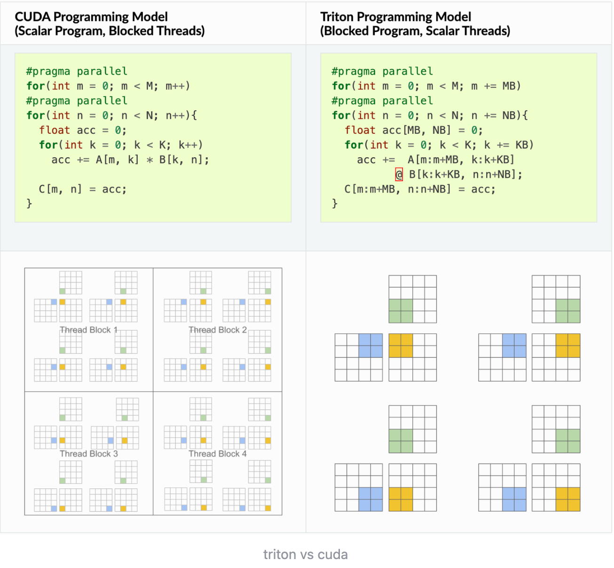

### 第一章
服务业，服务组织，服务的性质，服务科学

### 第二章
战略性服务与服务竞争环境，服务竞争战略
波特五力模型
SWOT分析

### 第三章
新服务开发
服务设计的方法

### 第四章
服务接触，三要素，服务利润链
### 第五章

### 第六章 服务指令
测量服务质量的方法：
里克特量表，SERVQUAL模型

质量控制图：
R图，X图，P图，计算UCL和LCL
$\bar{p}$代表整个过程的平均不合格品率

### 第七章
PDCA循环
计划（Plan）：确定目标和制定计划。
执行（Do）：实施计划并收集数据。
检查（Check）：分析数据，评估结果。 
行动（Act）：根据检查结果采取行动，改进过程。

六西格玛（Six Sigma），过程能力指数（Cp，Cpk），公式疑似出错

六西格玛是一种质量管理方法，旨在通过减少缺陷和变异来提高过程质量。过程能力指数（Cp，Cpk）用于衡量过程的能力，Cp表示过程的潜在能力，Cpk表示过程的实际能力。

### 第八章
服务选址问题
交叉中值法 ： 
哈夫零售选址模型 

### 第九章
钥匙型OPQRST因素

### 第十二章
这份课件（第12章 生产能力与需求管理）涉及的是经典的运营管理（Operations Management）中的数学计算 。这类题目初看可能觉得绕，但它们都有固定的套路和公式。

课件中主要涉及了**三类核心计算题**。为了让你彻底掌握，我将结合课件最后的“课内作业”（Slide 74-76），手把手教你如何破解它们。

---

### 第一类：超额预订决策（Overbooking）

**核心逻辑**：服务业（如酒店、航空）经常遇到顾客预订了却不来的情况（No-show）。为了不让房间空着，我们要“超卖”。但是超卖太多，如果顾客都来了，赔偿成本也很高 。我们要找一个平衡点 。
**核心公式（临界分位点法）** ：

$$P(d < x) \le \frac{C_u}{C_u + C_0}$$

* 
**$x$**: 超额预订的数量（我们要算的答案）。

* 
**$d$**: 顾客未出现的数量（变量）。

* 
**$C_u$ (Underage Cost)**: 订少了的损失（即一个房间空着的利润损失）。

* 
**$C_0$ (Overage Cost)**: 订多了的损失（即需要安排多余客人去别的酒店的赔偿成本）。

🎯 实战演练：课内作业 (1) 

> 
> **题目数据**：空房机会成本 $C_u = 69$美元 。附近度假村价格 $119$美元，酒店要填补差额 。未出现人数频次：0人(4次)，1人(3次)，2人(2次)，3人(1次) 。
> 
> 

**解题步骤**：

1. **计算成本**：
* 
$C_u = 69$ 美元 。

* 
$C_0 = 119 - 69 = 50$ 美元（因为酒店只需要“填补差额”）。

2. **计算临界比率**：
* $\text{Ratio} = \frac{69}{69 + 50} = \frac{69}{119} \approx 0.5798$

3. **计算累积概率 $P(d < x)$**：
* 总频次 = $4 + 3 + 2 + 1 = 10$ 次。
* 未出现 $0$ 人的概率 $P(0) = 4/10 = 0.4$
* 未出现 $1$ 人的概率 $P(1) = 3/10 = 0.3$
* 未出现 $2$ 人的概率 $P(2) = 2/10 = 0.2$
* 当 $x=1$ 时，$P(d < 1) = P(d=0) = 0.4$。因为 $0.4 \le 0.5798$，满足公式 。

* 当 $x=2$ 时，$P(d < 2) = P(0) + P(1) = 0.4 + 0.3 = 0.7$。因为 $0.7 > 0.5798$，超出临界值 。
**结论**：最佳超额预订数量为 **1间** 房间。

---

### 第二类：员工排班问题（Workforce Scheduling）

**核心逻辑**：在满足每天不同人数需求的前提下，雇佣最少的员工，且必须保证每位员工**连续休息2天** 。
**解题思路**：使用启发式排班法或线性规划 。通常的做法是优先把休息日安排在需求量最少的那几天。

🎯 实战演练：课内作业 (2) 

> 
> **题目数据**：每天所需接线员：周日(4), 周一(8), 周二(8), 周三(7), 周四(7), 周五(6), 周六(5) 。
> 
> 

**解题步骤**：

1. 
**找最低谷**：需求最少的是周日(4)和周六(5) 。所以最理想的休息日是**周六和周日**。

2. 
**确定最少人数**：周一和周二最高需求是 8 人 ，所以**至少需要 8 名员工**。

3. **排班构建**：
* 让尽可能多的人（4人）在【周六、周日】休息，这样他们在周一到周五工作。
* 周六还需要 5 人工作 ，周日需要 4 人 。我们可以安排 3 人在【周四、周五】休息，1 人在【周三、周四】休息。

* *具体分配方式有多种，核心目标是让总人数等于最高单日需求（8人），并让人员短缺（多余）天数最小化。*

---

### 第三类：收益管理与产能分配（Yield Management）

**核心逻辑**：服务业产能固定（如航班座位、酒店房间）。早期预订打折，临近预订全价 。我们要计算出：**为了防止全价客买不到票，我们应该“预留”多少个座位不打折？** **核心公式** ：

$$P(d < x) \le \frac{F - D}{p \cdot F}$$

**$F$**: 全价 (Full Fare) 。
**$D$**: 折扣价 (Discount Fare) 。
**$p$**: 顾客是“选购者”（即图便宜的打折客）的概率 。

**$x$**: 需要保留的全价座位/房间数（未知数）。

🎯 实战演练：课内作业 (3) 

> 
> **题目数据**：全价 $F = 299$，折扣价 $D = 159$ 。打算付全价的旅客是20%（意味着选购者打折客 $p = 1 - 0.20 = 0.80$）。全价需求呈正态分布，均值 $\mu = 50$，标准差 $\sigma = 10$ 。
> 
> 

**解题步骤**：

1. **计算临界比率**：

$$\frac{299 - 159}{0.80 \times 299} = \frac{140}{239.2} \approx 0.585$$

2. **查找正态分布 Z 值**：
我们需要找到一个点，其左侧累积面积为 $0.585$。查标准正态分布表，当面积为 $0.585$ 时，对应的 $Z$ 值大约为 **0.215**。
3. **计算保留数量 $x$**：

$$x = \mu + Z\sigma = 50 + 0.215 \times 10 = 52.15$$

**结论**：应该为付全款的旅客保留大约 **52 间** 客房。

---

### 第十三章
排队问题，泊松分布，指数分布
习题答案：
这是一道经典的运筹学与概率论问题，主要考察泊松分布（Poisson Distribution）**及其相关的**指数分布（Exponential Distribution）的应用。

根据题目已知条件：

* 平均到达率 $\lambda = 20$ 人/小时。

我们可以将其转化为以“分钟”为单位的到达率，方便后续计算：

* 每分钟平均到达率 = $20 \div 60 = 1/3$ 人/分钟。

以下是具体的步骤和解答：

### （1）接下来的 10 分钟另一位顾客进入的可能性是多大？

这个问题本质上是在问：**在接下来的 10 分钟内，至少有 1 名顾客到达的概率是多少？**（这等同于求顾客到达的时间间隔小于等于 10 分钟的概率）。

在泊松过程中，给定时间 $t$ 内到达 $k$ 个顾客的概率公式为：

$$P(X=k) = \frac{e^{-\mu} \cdot \mu^k}{k!}$$

其中，$\mu$ 是时间 $t$ 内的期望到达人数（$\mu = \text{每分钟到达率} \times t$）。

**计算步骤：**

1. 计算 10 分钟内的期望到达人数 ($\mu$)：

$$\mu = (1/3) \times 10 = 10/3 \approx 3.333 \text{ 人}$$

2. 计算 10 分钟内**没有**顾客到达的概率 $P(X=0)$：

$$P(X=0) = \frac{e^{-10/3} \cdot (10/3)^0}{0!} = e^{-3.333} \approx 0.0357$$

3. 计算 10 分钟内**至少有 1 位**顾客到达的概率 $P(X \ge 1)$：

$$P(X \ge 1) = 1 - P(X=0) = 1 - 0.0357 = 0.9643$$

答案：接下来的 10 分钟另一位顾客进入的可能性约为 **96.43%**。

---

### （2）两位顾客 5 分钟间隔内到达的可能性是多少？

这个问题是在问：**在一个固定的 5 分钟时间段内，恰好有 2 名顾客到达的概率是多少？** 这直接使用泊松分布的公式计算 $P(X=2)$。

**计算步骤：**

1. 计算 5 分钟内的期望到达人数 ($\mu$)：

$$\mu = (1/3) \times 5 = 5/3 \approx 1.667 \text{ 人}$$

2. 计算恰好有 2 名顾客到达的概率 $P(X=2)$：

$$P(X=2) = \frac{e^{-5/3} \cdot (5/3)^2}{2!} = \frac{e^{-1.667} \cdot 2.778}{2} \approx \frac{0.1889 \cdot 2.778}{2} \approx 0.2624$$

答案：两位顾客在 5 分钟间隔内到达的可能性约为 **26.24%**。

*(注：如果题目的意思是“恰好”10分钟进入“恰好”1个人，第一题的答案则是 $P(X=1) = e^{-10/3} \cdot (10/3)^1 \approx 11.89\%$。但通常在排队论语境中，“另一位顾客进入”指的是等待时间结束，即 $P(X \ge 1)$。)*

---

### 第十四章
第14章的核心是**服务生产率与绩效评估**。如果你觉得第12章的概率论和排队论有些绕，那么第14章完全是另一种画风——它主要考察的是**运筹学中的线性规划 (Linear Programming)**。

这一章的绝对主角是一个叫做 **DEA（数据包络分析，Data Envelopment Analysis）** 的模型，尤其是它的基础版：**CCR模型**。

在考试或实际作业中，DEA 的题目看起来非常吓人（满屏幕的 $\lambda$、$\theta$、$s^-$、$s^+$），但实际上它的**套路非常固定**。你不需要像计算机一样手算复杂的单纯形法，你需要掌握的是**如何列方程、如何看懂软件算出来的结果，以及如何提出改进建议**。

我把你在这章必须掌握的 **3 个核心考点**梳理出来了，我们一步步来：

---

### 考点一：看懂 DEA 是在干什么？（$\theta$ 和 $\lambda$ 的含义）

DEA 的目的是在一堆分店（或医院、医生，统称为“决策单元 DMU”）中，找出“最优秀的榜样”，并给落后的人打分，告诉他们差在哪里。

课件中主要使用的是**对偶形式的 CCR 模型** 。当你看到题目给出一个包含 $\theta$ 和 $\lambda$ 的结果时，你要立刻反应出它们的经济学含义：

1. **$\theta$ (效率得分)**：
* 如果 $\theta = 1$，说明这个单位是**有效率的**（处在生产前沿面上，是学霸）。

* 如果 $\theta < 1$，说明**无效率**。比如 $\theta = 0.6$，意味着这个单位在保持产出不变的情况下，**投入资源其实只需要现在的 60% 就够了**，浪费了 40%。

2. **$\lambda$ (参考权重/榜样系数)**：
* 如果一个单位没效率，它该向谁学习？$\lambda$ 大于 0 的那些单位，就是它的**学习榜样（参照组）**。

---

### 考点二：如何拯救差生？——“投影”计算 (Projection)

这是必考的计算题。当一个决策单元（DMU）被判定为无效率（$\theta < 1$）时，题目会问你：**它应该如何调整投入和产出，才能变得有效率？**

这就用到了课件里的“投影”公式 ：

* **目标投入量**：$\hat{x_0} = \theta_0 x_0 - s^{0-}$
* **目标产出量**：$\hat{y_0} = y_0 + s^{0+}$
*(注：如果题目没有给出松弛变量 $s^-$ 和 $s^+$，通常直接默认为 0 来计算理论缩减量。)*

🎯 课件例题 14.1 拆解 

**已知条件**：有 4 个决策单元。决策单元 4 (投入量 $x_0 = (4, 2)^T$，产出量 $y_0 = 1$) 是无效的。经过计算得出 $\theta_0 = 3/5 = 0.6$，松弛变量都是 0。
**问题**：计算决策单元 4 的投影（目标改进值）。

**解题步骤**：

1. **调整投入**：原来的投入是 $(4, 2)$，乘以效率得分 $0.6$。

$$\hat{x_0} = 0.6 \times \begin{pmatrix} 4 \\ 2 \end{pmatrix} - \begin{pmatrix} 0 \\ 0 \end{pmatrix} = \begin{pmatrix} 2.4 \\ 1.2 \end{pmatrix}$$

2. **调整产出**：原来的产出是 1，松弛变量是 0。

$$\hat{y_0} = 1 + 0 = 1$$

**结论**：决策单元 4 要想变得有效率，必须在保持产出 $1$ 不变的前提下，把第一项投入从 $4$ 降到 $2.4$，第二项投入从 $2$ 降到 $1.2$。

---

### 考点三：判断规模收益 (Returns to Scale)

除了技术效率，DEA 还能判断一个企业的“规模”是不是刚刚好。这就需要看所有**榜样权重 $\lambda$ 的总和** ：

设 $S = \frac{1}{\theta_0} \sum \lambda_j$

1. **$S = 1$**：**规模收益不变**。说明现在的规模最完美，不用扩大也不用缩小。
2. **$S < 1$**：**规模收益递增**。说明企业规模太小了，如果增加投入，产出的增加速度会更快，**应该扩张**。
3. **$S > 1$**：**规模收益递减**。说明企业规模太大了（机构臃肿），增加投入带来的产出很少，**应该精简缩减**。

🎯 课件例题 14.3 拆解 

**问题**：决策单元 1，解出 $\theta_0 = 5/6$，$\lambda_2 = 1/2$ (其余 $\lambda$ 为 0)。判断其规模收益。
**解题步骤**：

1. 计算权重和：$\sum \lambda = 1/2 = 0.5$
2. 计算 $S$：$S = \frac{1}{5/6} \times 0.5 = \frac{6}{5} \times \frac{1}{2} = \frac{3}{5} = 0.6$
**结论**：因为 $0.6 < 1$，所以决策单元 1 处于**规模收益递增**阶段。

---
为了让你彻底掌握这一章的核心考点，我将为你**完整梳理课件中给出的 4 道核心例题（例题 14.1 至 14.4）的详细计算过程与答案解析**。这四道题层层递进，分别对应了 DEA 的四个核心考点：**效率判定、投影改进、综合分析、规模收益判断**。

---

### 例题 14.1：如何判定 DEA 有效性并进行“投影”改进？

**【背景数据】**
有 4 个决策单元（DMU），每个单元有 2 个投入，1 个产出 ：

* DMU 1：产出 1，投入 (1, 3)
* DMU 2：产出 1，投入 (3, 1)
* DMU 3：产出 2，投入 (3, 3)
* DMU 4：产出 1，投入 (4, 2)

**【考点 1：效率判定】**
通过对偶形式的 CCR 模型（引入非阿基米德无穷小 $\epsilon = 10^{-6}$），用单纯形法求解出 $\theta_0$（效率得分）和 $s^-, s^+$（松弛变量）：

* 
**DMU 1、2、3**：解得 $\theta_0 = 1$，且 $s^- = s^+ = 0$ 。

* **结论**：这三个单元是 **DEA 有效的**（即既技术有效，又规模有效，是“学霸”）。

* 
**DMU 4**：解得 $\theta_0 = 3/5$ (即 0.6)，$s^- = s^+ = 0$，榜样权重 $\lambda_2 = 3/5, \lambda_3 = 1/5$ 。

* **结论**：$\theta_0 < 1$，DMU 4 **非 DEA 有效**。它的投入过多，存在浪费。

**【考点 2：如何拯救差生（投影计算）】**
对于无效的 DMU 4，我们要计算它在有效前沿面上的“投影”（即目标改进值） ：

* **目标投入量公式**：$\hat{x_0} = \theta_0 x_0 - s^{0-}$
* 计算：$\hat{x_0} = \frac{3}{5} \times \begin{pmatrix} 4 \\ 2 \end{pmatrix} - \begin{pmatrix} 0 \\ 0 \end{pmatrix} = \begin{pmatrix} 12/5 \\ 6/5 \end{pmatrix} = \begin{pmatrix} 2.4 \\ 1.2 \end{pmatrix}$

* **目标产出量公式**：$\hat{y_0} = y_0 + s^{0+}$
* 计算：$\hat{y_0} = 1 + 0 = 1$

* 
**最终答案**：DMU 4 要想变得有效率，必须在保持**产出 1 不变**的前提下，将第一项投入从 4 缩减到 **2.4**，第二项投入从 2 缩减到 **1.2** 。

---

### 例题 14.2：技术有效 vs. 规模有效

**【背景数据】**
单投入单产出的 3 个决策单元 ：

* DMU 1：产出 2，投入 2
* DMU 2：产出 1，投入 4
* DMU 3：产出 3.5，投入 5

**【答案与解析】**

* 
**DMU 1**：最优解 $\theta_0 = 1$，$s^- = s^+ = 0$ 。

* **结论**：同时**技术有效**和**规模有效**（最佳状态）。

* 
**DMU 2**：最优解 $\theta_0 = 1/4$ 。

* **结论**：因为 $\theta_0 < 1$，既**非技术有效**，也**非规模有效**（产出低投入高，纯属浪费）。

* 
**DMU 3**：最优解 $\theta_0 = 7/10$ (即 0.7) 。

* 
**结论**：在此单投入单产出模型中，它是**技术有效但非规模有效**。它的生产率（3.5/5=0.7）比不上 DMU1（2/2=1），规模扩张带来了收益递减 。

---

### 例题 14.3：如何判断“规模收益”（Returns to Scale）？

**【核心判定公式】**
看所有榜样权重 $\lambda$ 的总和。设 $S = \frac{1}{\theta_0} \sum \lambda_j$ 。

* $S = 1$：规模收益不变（完美规模）。
* $S < 1$：规模收益递增（规模太小，应扩大）。
* $S > 1$：规模收益递减（机构臃肿，应缩小）。

**【背景数据与答案】**
单投入单产出，5 个决策单元 。

* **DMU 1**（投入 3，产出 2）：解得 $\theta_0 = 5/6$，$\sum \lambda = 1/2$。
* 计算 $S = \frac{1}{5/6} \times \frac{1}{2} = \frac{3}{5} < 1$。
* 
**结论**：非 DEA 有效，**规模收益递增** 。

* **DMU 2**（投入 5，产出 4）：解得 $\theta_0 = 1$，$\sum \lambda = 1$。
* 计算 $S = 1 \times 1 = 1$。
* 
**结论**：DEA 有效，**规模收益不变** 。

* 
**DMU 5**（投入 6，产出 4.5）*(注：课件第72页标题误写为决策单元3，实际计算的是单元5的数据)*：解得 $\theta_0 = 15/16$，$\sum \lambda = 9/8$ 。

* 计算 $S = \frac{16}{15} \times \frac{9}{8} = 1.2 > 1$。
* 
**结论**：非 DEA 有效，**规模收益递减** 。

---

### 例题 14.4：实战应用——银行分行绩效评估

**【背景数据】**
6 个银行分行，1个产出（业务量），2个投入（租金、出纳员工时） 。

**【以“分行 3”为例的完整解答】**
分行 3 原始数据：业务量 70，租金 28，出纳工时 2.1。

1. 
**判定效率**：解得 $\theta_0 = 0.8571$ (即 85.71%)。这意味着它不仅**低效**，而且投入只需现在的 85.71% 就能完成相同的业务量 。

2. 
**寻找榜样**：解得 $\lambda_2 = 0.2857$，$\lambda_4 = 0.7143$。这意味着分行 3 应该向**分行 2** 和 **分行 4** 学习（它们是分行 3 的参照组） 。

3. **制定改进目标（投影）**：
* 目标租金 = $28 \times 0.8571 = \mathbf{24}$ (千美元) 。

* 目标工时 = $2.1 \times 0.8571 = \mathbf{1.8}$ (千小时) 。

* **最终建议**：分行 3 在保持 70 千笔业务量不变的情况下，应想办法将租金成本降至 24 千美元，并将出纳员工时压缩至 1800 小时。

### 第十五章
第15章《能力规划与排队模型》**是运营管理中非常经典、也非常实用的一章。如果说上一章的DEA模型是为了评估“过去的效率”，那么这一章的排队论（Queuing Theory）就是为了**“规划未来的产能”。

在日常生活中，我们经常会遇到排队：去超市结账、去银行办业务、甚至登录热门游戏服务器。排队论的核心目的，就是帮助企业在“服务成本（多雇人）”**和**“等待成本（顾客流失）”之间找到最优的平衡点 。

为了让你不被复杂的公式吓倒，我们先梳理核心“黑话”，然后直接通过拆解最后的“课内作业”来实战应用！

---

### 一、 核心“黑话”与排队模型符号

在排队论中，你会频繁看到以下几个核心字母，它们是解题的钥匙：

* **$\lambda$ (Lambda)**：**到达率**。即单位时间内平均来多少个顾客（如：15人/小时）。
* **$\mu$ (Mu)**：**服务率**。即一个服务台单位时间内平均能服务多少个顾客。
* **$c$**：**服务台数量**。
* 
**$\rho$ (Rho)**：**服务强度（利用率）**。公式是 $\rho = \frac{\lambda}{c \mu}$。**注意：$\rho$ 必须小于1**，否则队伍会无限变长，系统会崩溃 。

**关于结果指标（L代表数量，W代表时间；s代表系统，q代表队列）：**

* **$L_s$**：系统中总共的顾客数（排队的 + 正在接受服务的）。
* **$L_q$**：正在排队的顾客数。
* **$W_s$**：顾客在系统中花费的总时间（周转时间）。
* **$W_q$**：顾客纯排队等待的时间。

(注：它们之间满足 Little's Law（利特尔法则）：$L_s = \lambda W_s$， $L_q = \lambda W_q$ )

---

### 二、 实战拆解：课内作业 (1) —— 基础排队与空间限制

**【题目背景】** 
航空公司有 1 名检票员（$c=1$），乘客到达率 $\lambda = 15$ 人/小时（服从泊松分布）。每位乘客检票平均需要 3 分钟（服从指数分布）。这是一个标准的 **M/M/1 模型**。

**【解题步骤】**
**第一步：统一单位，计算核心参数**

* $\lambda = 15$ 人/小时。
* 服务时间 3 分钟/人 $\rightarrow$ 服务率 $\mu = 60 / 3 = 20$ 人/小时。
* 服务强度（这里为了带入课件公式，记 $r = \frac{\lambda}{\mu}$，由于是单服务台，所以 $\rho = r = \frac{15}{20} = 0.75$）。

**问题 a) 乘客到达后不用等待，可立即接受服务的概率是多少？**

* 不用等待，意味着系统里当前**0个**人（检票员闲着）。
* 计算系统空闲概率 $P_0 = 1 - \rho = 1 - 0.75 = \mathbf{0.25}$ （即 **25%**）。

**问题 b) 检票口只能容纳3名顾客（含正在检票的1人）。等待区域无法容纳的概率？**

* 这意味着当系统里已经有 3 个人（或以上）时，新来的人就挤不进去了。
* 我们需要求的是系统里人数 $n \ge 3$ 的概率。
* 根据公式 $P(n \ge k) = \rho^k$ 。

* $P(n \ge 3) = 0.75^3 = \mathbf{0.421875}$ （即大约 **42.19%** 的时间区域会爆满）。

---

### 三、 实战拆解：课内作业 (2) —— 成本最小化与“合并排队”的魔法

这是一道极其经典的考试题，它揭示了排队论中最核心的管理学原理：**合并排队（Pooling）的力量** 。

**【题目背景】**
到达率增加到 $\lambda = 20$ 人/小时。顾客等待成本 $C_w = 15$ 美元/小时。检票员工资 $C_s = 10$ 美元/小时。检票仍需 3 分钟（$\mu = 20$ 人/小时）。要比较三种方案的**总成本 ($TC = 服务成本 + 等待成本 = c \cdot C_s + L_q \cdot C_w$)**。

**方案 A：增加1名检票员，分成2条独立队伍 (两个独立的 M/M/1)**

* 到达率被平分：每条队伍 $\lambda = 10$，$\mu = 20$。
* 单队伍排队人数 $L_q = \frac{\rho \lambda}{\mu - \lambda} = \frac{(0.5 \times 10)}{20 - 10} = 0.5$ 人 。

* 因为有 2 条队伍，总排队人数 $L_{q(total)} = 0.5 \times 2 = 1.0$ 人。
* **总成本 $TC$** = 2名员工工资 + 1人等待成本 = $2 \times 10 + 1.0 \times 15 = \mathbf{35}$ **美元/小时**。

**方案 B：增加1台自动机器（服务时间固定为3分钟，无服务成本）(M/M/1 + M/D/1)**

* 人流平分，一半人工（$\lambda=10$），一半机器（$\lambda=10$）。
* **人工端 (M/M/1)**：与方案A相同，$L_q = 0.5$ 人。
* 
**机器端 (M/D/1)**：服务时间是常数(D)。利用公式 $L_q = \frac{\rho^2}{2(1-\rho)}$ （注意此处没有方差项，因为时间是常数）。$\rho = 10/20 = 0.5$。
机器端 $L_q = \frac{0.5^2}{2 \times (1-0.5)} = \frac{0.25}{1} = 0.25$ 人。

* **总成本 $TC$** = 1名员工工资(10) + 人工端等待(0.5×15) + 机器端等待(0.25×15) = $10 + 7.5 + 3.75 = \mathbf{21.25}$ **美元/小时**。

**方案 C：两名检票员，合并为1条蛇形队伍 (M/M/2)**

* 这是一个多服务台模型：$c=2$, $\lambda=20$, $\mu=20$。记 $r = \lambda/\mu = 1$。
* 利用 M/M/c 公式先算空闲概率 $P_0$ ：
$P_0 = \frac{1}{1 + 1 + \frac{1^2}{2!(1 - 0.5)}} = \frac{1}{1 + 1 + 1} = \frac{1}{3}$

* 再算排队人数 $L_q$ ：
$L_s = \frac{1^3}{1! \times (2-1)^2} \times \frac{1}{3} + 1 = \frac{1}{3} + 1 = \frac{4}{3}$
$L_q = L_s - r = \frac{4}{3} - 1 = \frac{1}{3}$ 人（约 0.33 人）。

* **总成本 $TC$** = 2名员工工资 + $L_q$等待成本 = $2 \times 10 + \frac{1}{3} \times 15 = 20 + 5 = \mathbf{25}$ **美元/小时**。

**【管理学结论】**
虽然方案 B 成本最低（因为机器不要钱），但如果你比较**方案 A (两个队伍)** 和 **方案 C (合并为一条队伍)**，你会发现惊人的事实：在员工一样多的情况下，**合并为一条队伍使排队人数从 1.0 暴降到了 0.33！** 这就是为什么机场、银行、迪士尼现在全都采用“蛇形排队，多窗口服务”的原因。

### 第十六章
服务预测的时间序列模型

### 第十七章
库存管理相关

### 第十八章
第18章《服务项目管理》**将我们的视角从“日常循环的运营”转向了“一次性的、独特的任务”。无论是开发一款新软件、筹备一场大型会议，还是实施一次企业搬迁，这些都是**项目（Project）。

这一章的核心目的，是教你如何在时间（进度）、成本（预算）和质量（范围）这“项目管理铁三角”中取得平衡。

根据课件内容，我为你梳理了这章必考、必懂的 **4 个核心知识模块**：

---

### 核心一：关键路线法 (CPM - Critical Path Method)

这是项目时间管理的核心。一个项目通常由几十上百个相互关联的活动（Activity）组成。

* **什么是关键路线？** 它是项目网络图中**耗时最长**的那条路径。
* **为什么它叫“关键”？** 因为关键路线上的任何一个活动如果延期，**整个项目就会跟着延期**。这些活动没有“机动时间”（即松弛时间 Slack = 0）。
* **管理启示**：作为项目经理，你的眼睛必须死死盯住关键路线上的任务。非关键路线上的任务稍微拖延几天（只要不超过其松弛时间），并不会影响最终交付。

### 核心二：项目赶工 / 突击活动 (Project Crashing)

当老板要求你“把原定 6 个月的项目压缩到 5 个月完成”时，你就需要“赶工”。

* **赶工的代价**：加快进度通常意味着需要加班、增加人手或使用更贵的设备，这会增加**直接成本**。
* **赶工的黄金法则**：
1. 你**只能**去压缩“关键路线”上的活动（压缩非关键路线纯属浪费钱，因为不会缩短总工期）。
2. 在关键路线上，优先挑选“压缩单位时间成本最低”的活动下手。

### 核心三：应对不确定性 (PERT技术)

很多时候，我们无法准确知道一个活动究竟需要多长时间。PERT（计划评审技术）引入了概率论来解决这个问题。
它要求对每个活动估算三个时间：

1. **乐观时间 (a)**：一切顺利需要多久。
2. **最可能时间 (m)**：正常情况下需要多久。
3. **悲观时间 (b)**：倒霉透顶需要多久。

* **期望时间公式**：$t = \frac{a + 4m + b}{6}$。通过这种加权平均，得出的时间比拍脑袋估算要科学得多。

### 核心四：挣值管理 (EVM - Earned Value Management) 🏆 (重点/难点)

这是项目执行过程中**最强大**的监控工具。它能同时告诉你项目的**进度**和**成本**是否健康。课件中专门提到了“挣值图”和三个极其重要的缩写。

不要被这几个英文字母吓到，我们把它们翻译成“人话”：

1. **BCWS (Budgeted Cost of Work Scheduled / 计划工作预算成本)**：
* **人话**：按照原计划，到今天为止我**应该干完**多少活？这些活的预算是多少？

2. **ACWP (Actual Cost of Work Performed / 已完成工作实际成本)**：
* **人话**：到今天为止，我**实际花掉**了多少真金白银？

3. **BCWP (Budgeted Cost of Work Performed / 已完成工作预算成本，即“挣值 Earned Value”)**：
* **人话**：到今天为止，我**实际干完**了多少活？这些干完的活，按原计划值多少钱？（这就是你“挣”来的价值）。

**如何判断项目健康状况？(做减法)**

* **成本差距 (Cost Variance, CV) = BCWP - ACWP**
* 如果 $CV > 0$：省钱了！（干完的活价值 > 实际花的钱）
* 如果 $CV < 0$：超支了！

* **进度差距 (Schedule Variance, SV) = BCWP - BCWS**
* 如果 $SV > 0$：进度超前！（干完的活 > 计划该干的活）
* 如果 $SV < 0$：进度落后！

---
第18章的课内作业非常经典，这三道题是一套“组合拳”，完美覆盖了项目管理中最核心的三大计算工具：**关键路线法 (CPM)**、**项目赶工 (Crashing)** 和 **计划评审技术 (PERT)**。

下面我为你逐一拆解这三道题的计算逻辑和标准答案。

---

### 第 1 题：寻找关键路线与计算项目工期 (CPM)

**【解题思路】**
要求算出关键路线和项目工期，我们需要梳理出网络图中所有的可能路径，并计算它们的总时间 。耗时最长的那条路线就是**关键路线**，它的时间就是整个项目的最短完工时间。

根据网络图，从“开始”到终点 $I$，共有 5 条路径：

1. **路径 1**：$A(4) \rightarrow D(6) \rightarrow G(4) \rightarrow I(2)$ = 16 天
2. **路径 2**：$A(4) \rightarrow E(3) \rightarrow I(2)$ = 9 天
3. **路径 3**：$A(4) \rightarrow H(6) \rightarrow I(2)$ = 12 天
4. **路径 4**：$B(3) \rightarrow H(6) \rightarrow I(2)$ = 11 天
5. **路径 5**：$C(4) \rightarrow F(5) \rightarrow H(6) \rightarrow I(2)$ = 17 天

**【计算结论】**

* **关键路线**：耗时最长的路线是 **$C \rightarrow F \rightarrow H \rightarrow I$**。
* **项目工期**：**17 天**。

*(注：关键路线上的活动 $C, F, H, I$ 的缓冲时间 $TS$ 均为 0，因为它们没有任何可拖延的余地。以活动 $H$ 为例，它的前置活动 $C(4)+F(5)=9$ 天，所以最早开始时间 $ES = 9$；活动本身需要 6 天，最早完成 $EF = 15$。由于它在关键路线上，$LS=9, LF=15$，缓冲时间 $TS = 9-9 = 0$。)*

---

### 第 2 题：项目赶工 / 突击活动 (Crashing)

**【题目规则】**

* 
**目标**：将项目工期缩短 3 天（从 17 天降至 14 天）。

* 
**成本规则**：赶工成本 = 该活动的正常天数（例如缩短 $H$ 1天花费 6 美元）。

* 
**约束条件**：每项活动最多只能压缩 1 天 。

* 
**赶工原则**：只能压缩**关键路线**上的活动，且优先挑**最便宜**的下手 。

**【逐步突击过程】**
目前关键路线是 $C-F-H-I$ (17天)，第二长的是 $A-D-G-I$ (16天)。

* **第 1 步：从 17 天压缩到 16 天**
* 在关键路线 ($C, F, H, I$) 上找最便宜的。成本分别为：$C(\$4), F(\$5), H(\$6), I(\$2)$。
* **行动**：压缩 **$I$** 活动 1 天。
* **花费**：**$2**。
* **当前状态**：关键路线变为 $C-F-H-I$ (16天)。注意，因为 $I$ 也是 $A-D-G-I$ 的一部分，这条路也被缩短成了 15 天。

* **第 2 步：从 16 天压缩到 15 天**
* 继续在关键路线 ($C, F, H$) 上找最便宜的（$I$ 已经达到极限不能再压了）。

* 成本分别为：$C(\$4), F(\$5), H(\$6)$。最便宜的是 $C$。
* **行动**：压缩 **$C$** 活动 1 天。
* **花费**：**$4**。
* **当前状态**：此时出现了**两条**关键路线！$C-F-H-I$ 变成了 15 天，$A-D-G-I$ 也是 15 天。

* **第 3 步：从 15 天压缩到 14 天**
* 现在有两条并列的关键路线，必须**同时压缩这两条路线**，总工期才会下降 。

* 路线 1 ($C-F-H-I$) 可压项：$F(\$5), H(\$6)$。
* 路线 2 ($A-D-G-I$) 可压项：$A(\$4), D(\$6), G(\$4)$。
* 我们需要各挑一个最便宜的组合：选 $F(\$5)$ 加上 $A(\$4)$，或者 $F(\$5)$ 加上 $G(\$4)$。
* **行动**：同时压缩 **$F$** 和 **$A$** (或 $G$) 各 1 天。
* **花费**：$5 + 4 =$ **$9**。

**【最终答案】**
为了以最低成本将工期缩短 3 天，应该突击的活动是：**$I, C, F, A$** (或 $I, C, F, G$)。
最低总成本为：$2 + 4 + 9 =$ **15 美元**。

---

### 第 3 题：应对不确定性 (PERT技术)

**【解题思路】**
这道题考察的是当活动时间变成“概率分布”时，如何求项目在指定时间内完成的概率。核心在于：**整个项目的方差，等于关键路线上所有活动方差的总和** 。

**第一步：确定当前的期望工期和方差**
根据题目给出的表 ，关键路线依然是 $C-F-H-I$（因为它们的均值总和 4+5+6+2 = 17 天，仍然是最长的）。

* **期望项目工期 ($\mu$)** = 17 天。
* **项目总方差 ($\sigma^2$)** = 关键路线上活动的方差之和

$$\sigma^2 = \sigma^2_C + \sigma^2_F + \sigma^2_H + \sigma^2_I$$

$$\sigma^2 = \frac{4}{36} + \frac{100}{36} + \frac{64}{36} + 0 = \frac{168}{36} \approx 4.667$$

**第二步：计算标准差 (Standard Deviation)**

$$\sigma = \sqrt{4.667} \approx 2.16 \text{ 天}$$

**第三步：计算正态分布的 Z 值**
我们要算的是在 $X = 20$ 天内完成的概率 。套用 Z 值公式 ：

$$Z = \frac{X - \mu}{\sigma} = \frac{20 - 17}{2.16} = \frac{3}{2.16} \approx 1.389$$

**【最终答案】**
查标准正态分布表，当 $Z = 1.39$ 时，对应的累积概率约为 **0.9177**。
因此，在不突击任何活动的情况下，在 20 天内完成该项目的概率大约为 **91.77%**。